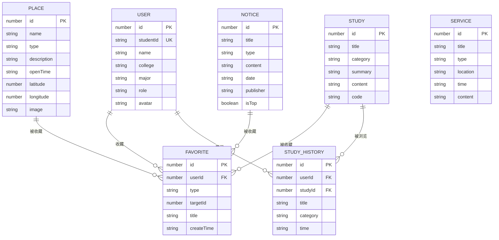

# 校园通——数据库设计文档

## 一、数据库设计说明

本项目为微信小程序课程大作业，数据层采用分阶段设计方案：

- **课程作业阶段（当前）：** 使用本地 Mock 数据文件（`utils/*Data.js`）+ 微信小程序本地缓存（`wx.setStorageSync` / `wx.getStorageSync`）
- **后续扩展阶段：** 可迁移到微信云开发数据库（`wx.cloud.database()`），集合结构与本地 Mock 数据结构一一对应

本文档定义的数据结构既是当前 Mock 数据的规范，也是后续云数据库建集合的依据。

## 二、本地 Mock 数据与云数据库的关系

| 对比维度 | 本地 Mock 数据（当前） | 云数据库（后续） |
|----------|----------------------|-----------------|
| 存储位置 | `utils/*Data.js` 文件 | 微信云开发数据库集合 |
| 读取方式 | `require()` 直接引入 | `wx.cloud.database().collection().get()` |
| 写入方式 | `wx.setStorageSync` 写本地缓存 | `.add()` / `.update()` 写云端 |
| 数据持久性 | 清除缓存即丢失 | 云端永久保存 |
| 多设备同步 | 不支持 | 支持 |
| 切换方式 | 修改 `utils/request.js` 中 DATA_SOURCE 即可 | - |

数据结构保持一致，切换数据源时页面代码无需修改。

## 三、ER 实体关系图




## 四、数据库集合设计

### 4.1 users 用户集合

**用途说明：** 存储用户基本信息，课程作业阶段使用预设模拟数据。

**字段表：**

| 字段名 | 类型 | 必填 | 说明 | 示例值 |
|--------|------|------|------|--------|
| id | Number | 是 | 用户编号 | 1 |
| studentId | String | 是 | 学号（唯一） | "20260001" |
| name | String | 是 | 姓名 | "张三" |
| college | String | 是 | 学院 | "计算机学院" |
| major | String | 是 | 专业 | "软件工程" |
| role | String | 是 | 用户角色（student/admin） | "student" |
| avatar | String | 否 | 头像路径 | "/images/avatar.png" |

**JSON 示例数据：**

```json
[
  {
    "id": 1,
    "studentId": "20260001",
    "name": "张三",
    "college": "计算机学院",
    "major": "软件工程",
    "role": "student",
    "avatar": "/images/avatar.png"
  },
  {
    "id": 2,
    "studentId": "20260002",
    "name": "李四",
    "college": "计算机学院",
    "major": "计算机科学与技术",
    "role": "student",
    "avatar": "/images/avatar.png"
  },
  {
    "id": 3,
    "studentId": "admin001",
    "name": "管理员",
    "college": "计算机学院",
    "major": "系统管理",
    "role": "admin",
    "avatar": "/images/avatar.png"
  }
]
```

> **说明：** `admin001` 为轻量模拟管理员账号，用于答辩展示管理员身份识别功能（P2 可选扩展）。

---

### 4.2 places 校园地点集合

**用途说明：** 存储校园建筑地点信息，包括名称、类型、位置坐标等。

**字段表：**

| 字段名 | 类型 | 必填 | 说明 | 示例值 |
|--------|------|------|------|--------|
| id | Number | 是 | 地点编号 | 1 |
| name | String | 是 | 地点名称 | "图书馆" |
| type | String | 是 | 地点类型 | "学习场所" |
| description | String | 是 | 地点介绍 | "提供图书借阅、自习等服务" |
| openTime | String | 是 | 开放时间 | "08:00-22:00" |
| latitude | Number | 是 | 纬度 | 23.0601 |
| longitude | Number | 是 | 经度 | 112.4621 |
| image | String | 是 | 图片路径 | "/images/places/library.jpg" |

**JSON 示例数据：**

```json
[
  {
    "id": 1,
    "name": "图书馆",
    "type": "学习场所",
    "description": "图书馆主要提供图书借阅、自习、电子资源查询等服务。",
    "openTime": "08:00-22:00",
    "latitude": 23.0601,
    "longitude": 112.4621,
    "image": "/images/places/library.jpg"
  },
  {
    "id": 2,
    "name": "第一教学楼",
    "type": "教学场所",
    "description": "第一教学楼主要用于日常课程教学和实验实训。",
    "openTime": "07:30-22:00",
    "latitude": 23.0615,
    "longitude": 112.4630,
    "image": "/images/places/building1.jpg"
  },
  {
    "id": 3,
    "name": "学生食堂",
    "type": "生活场所",
    "description": "学生食堂提供早餐、午餐、晚餐等餐饮服务。",
    "openTime": "07:00-20:00",
    "latitude": 23.0590,
    "longitude": 112.4615,
    "image": "/images/places/canteen.jpg"
  },
  {
    "id": 4,
    "name": "运动场",
    "type": "运动场所",
    "description": "包含田径场、篮球场、足球场等运动设施。",
    "openTime": "06:00-22:00",
    "latitude": 23.0580,
    "longitude": 112.4640,
    "image": "/images/places/stadium.jpg"
  },
  {
    "id": 5,
    "name": "学生宿舍区",
    "type": "生活场所",
    "description": "学生住宿区域，配有门禁系统和生活服务设施。",
    "openTime": "全天",
    "latitude": 23.0570,
    "longitude": 112.4610,
    "image": "/images/places/dormitory.jpg"
  }
]
```

---

### 4.3 services 校园服务集合

**用途说明：** 存储校园各类服务信息。

**字段表：**

| 字段名 | 类型 | 必填 | 说明 | 示例值 |
|--------|------|------|------|--------|
| id | Number | 是 | 服务编号 | 1 |
| title | String | 是 | 服务名称 | "图书馆服务" |
| type | String | 是 | 服务类型 | "学习服务" |
| location | String | 是 | 服务地点 | "图书馆" |
| time | String | 是 | 服务时间 | "08:00-22:00" |
| content | String | 是 | 服务说明 | "提供图书借阅等服务" |

**JSON 示例数据：**

```json
[
  {
    "id": 1,
    "title": "图书馆服务",
    "type": "学习服务",
    "location": "图书馆",
    "time": "08:00-22:00",
    "content": "提供图书借阅、自习座位、电子资源查询等服务。"
  },
  {
    "id": 2,
    "title": "食堂服务",
    "type": "生活服务",
    "location": "学生食堂",
    "time": "07:00-20:00",
    "content": "提供早餐、午餐、晚餐等餐饮服务。"
  },
  {
    "id": 3,
    "title": "体育馆服务",
    "type": "运动服务",
    "location": "体育馆",
    "time": "08:00-21:00",
    "content": "提供羽毛球、乒乓球、健身等运动场地。"
  },
  {
    "id": 4,
    "title": "校园活动",
    "type": "活动服务",
    "location": "学术报告厅",
    "time": "根据活动安排",
    "content": "定期举办学术讲座、科技文化活动、社团活动等。"
  }
]
```

---

### 4.4 studies 学习内容集合

**用途说明：** 存储前端学习专区的知识点内容和代码示例。

**字段表：**

| 字段名 | 类型 | 必填 | 说明 | 示例值 |
|--------|------|------|------|--------|
| id | Number | 是 | 内容编号 | 1 |
| title | String | 是 | 标题 | "WXML 基础" |
| category | String | 是 | 分类 | "页面结构" |
| summary | String | 是 | 简介 | "WXML 是微信小程序的页面结构语言" |
| content | String | 是 | 详细内容 | "WXML 用于描述小程序页面结构..." |
| code | String | 是 | 示例代码 | "<view class='box'>容器</view>" |

**JSON 示例数据：**

```json
[
  {
    "id": 1,
    "title": "WXML 基础",
    "category": "页面结构",
    "summary": "WXML 是微信小程序的页面结构语言，类似于 HTML。",
    "content": "WXML 用于描述小程序页面结构，常见组件包括 view、text、image 等。支持数据绑定、条件渲染、列表渲染等特性。",
    "code": "<view class='container'>\n  <text>{{message}}</text>\n  <image src='{{imgUrl}}' />\n</view>"
  },
  {
    "id": 2,
    "title": "WXSS 样式",
    "category": "页面样式",
    "summary": "WXSS 是微信小程序的样式语言，类似于 CSS。",
    "content": "WXSS 支持大部分 CSS 特性，新增了 rpx 响应式单位。推荐使用 flex 布局进行页面排版。",
    "code": ".container {\n  display: flex;\n  padding: 20rpx;\n  font-size: 28rpx;\n}"
  },
  {
    "id": 3,
    "title": "数据绑定",
    "category": "页面逻辑",
    "summary": "通过 {{}} 语法将 data 中的数据绑定到页面。",
    "content": "小程序使用 Mustache 语法进行数据绑定，在 WXML 中使用 {{变量名}} 引用 Page data 中的数据。",
    "code": "Page({\n  data: {\n    message: 'Hello World'\n  }\n})"
  },
  {
    "id": 4,
    "title": "页面生命周期",
    "category": "生命周期",
    "summary": "小程序页面从创建到销毁的完整生命周期。",
    "content": "页面生命周期包括 onLoad（页面加载）、onShow（页面显示）、onReady（页面就绪）、onHide（页面隐藏）、onUnload（页面卸载）。",
    "code": "Page({\n  onLoad(options) { },\n  onShow() { },\n  onReady() { },\n  onHide() { },\n  onUnload() { }\n})"
  },
  {
    "id": 5,
    "title": "wx.setStorage 本地缓存",
    "category": "小程序 API",
    "summary": "wx.setStorage 用于将数据存储到本地缓存中。",
    "content": "在用户登录、收藏、学习记录等场景中，可以使用 wx.setStorage 保存数据。同步版本为 wx.setStorageSync。",
    "code": "wx.setStorage({\n  key: 'userInfo',\n  data: { name: '张三' },\n  success() {\n    console.log('保存成功')\n  }\n})"
  },
  {
    "id": 6,
    "title": "单例模式",
    "category": "设计模式",
    "summary": "确保一个类只有一个实例，并提供全局访问点。",
    "content": "在小程序中，单例模式常用于管理用户状态。通过模块导出唯一对象，所有页面共享同一个实例，避免状态不一致。",
    "code": "const UserManager = {\n  getUserInfo() {\n    return wx.getStorageSync('userInfo')\n  },\n  login(info) {\n    wx.setStorageSync('userInfo', info)\n  }\n}\nmodule.exports = UserManager"
  },
  {
    "id": 7,
    "title": "观察者模式",
    "category": "设计模式",
    "summary": "定义对象间一对多的依赖关系，状态变化时通知所有观察者。",
    "content": "在小程序中，观察者模式用于收藏状态跨页面同步。当用户收藏操作发生时，所有订阅了收藏变化的页面和组件都会收到通知并自动更新。",
    "code": "const Subject = {\n  observers: [],\n  attach(ob) { this.observers.push(ob) },\n  detach(ob) { this.observers = this.observers.filter(i => i !== ob) },\n  notify(event) { this.observers.forEach(ob => ob.update(event)) }\n}\nmodule.exports = Subject"
  }
]
```


---

### 4.5 notices 公告集合

**用途说明：** 存储校园公告和活动通知信息。

**字段表：**

| 字段名 | 类型 | 必填 | 说明 | 示例值 |
|--------|------|------|------|--------|
| id | Number | 是 | 公告编号 | 1 |
| title | String | 是 | 公告标题 | "关于期末课程设计提交的通知" |
| type | String | 是 | 公告类型 | "课程通知" |
| content | String | 是 | 公告内容 | "请各小组按要求提交..." |
| date | String | 是 | 发布时间 | "2026-05-12" |
| publisher | String | 是 | 发布者 | "计算机学院" |
| isTop | Boolean | 是 | 是否置顶 | true |

**JSON 示例数据：**

```json
[
  {
    "id": 1,
    "title": "关于期末课程设计提交的通知",
    "type": "课程通知",
    "content": "请各小组按要求提交项目源代码、设计说明书、答辩 PPT 和讲解视频。提交截止时间为 2026 年 5 月 20 日。",
    "date": "2026-05-12",
    "publisher": "计算机学院",
    "isTop": true
  },
  {
    "id": 2,
    "title": "校园活动报名通知",
    "type": "活动通知",
    "content": "学校将举办校园科技文化活动，欢迎同学们积极参与。活动时间：2026 年 5 月 18 日，地点：学术报告厅。",
    "date": "2026-05-15",
    "publisher": "学生工作处",
    "isTop": false
  },
  {
    "id": 3,
    "title": "图书馆开放时间调整通知",
    "type": "校园通知",
    "content": "因期末考试临近，图书馆开放时间调整为 07:00-23:00，请同学们合理安排学习时间。",
    "date": "2026-05-10",
    "publisher": "图书馆",
    "isTop": false
  },
  {
    "id": 4,
    "title": "前端技术分享会",
    "type": "活动通知",
    "content": "计算机学院将举办前端技术分享会，主题为微信小程序开发实践。时间：2026 年 5 月 16 日 14:00，地点：实验楼 301。",
    "date": "2026-05-13",
    "publisher": "计算机学院",
    "isTop": false
  }
]
```

---

### 4.6 favorites 收藏集合

**用途说明：** 存储用户的收藏记录，支持地点、学习内容、公告三种类型。

**字段表：**

| 字段名 | 类型 | 必填 | 说明 | 示例值 |
|--------|------|------|------|--------|
| id | Number | 是 | 收藏编号 | 1 |
| userId | Number | 是 | 用户编号 | 1 |
| type | String | 是 | 收藏类型（place/study/notice） | "place" |
| targetId | Number | 是 | 目标编号 | 1 |
| title | String | 是 | 收藏标题 | "图书馆" |
| createTime | String | 是 | 收藏时间 | "2026-05-12 10:30" |

**JSON 示例数据：**

```json
[
  {
    "id": 1,
    "userId": 1,
    "type": "place",
    "targetId": 1,
    "title": "图书馆",
    "createTime": "2026-05-12 10:30"
  },
  {
    "id": 2,
    "userId": 1,
    "type": "study",
    "targetId": 1,
    "title": "WXML 基础",
    "createTime": "2026-05-12 11:00"
  },
  {
    "id": 3,
    "userId": 1,
    "type": "notice",
    "targetId": 1,
    "title": "关于期末课程设计提交的通知",
    "createTime": "2026-05-12 14:20"
  }
]
```

---

### 4.7 study_history 学习记录集合

**用途说明：** 存储用户浏览学习内容的历史记录。

**字段表：**

| 字段名 | 类型 | 必填 | 说明 | 示例值 |
|--------|------|------|------|--------|
| id | Number | 是 | 记录编号 | 1 |
| userId | Number | 是 | 用户编号 | 1 |
| studyId | Number | 是 | 学习内容编号 | 1 |
| title | String | 是 | 标题 | "WXML 基础" |
| category | String | 是 | 分类 | "页面结构" |
| time | String | 是 | 浏览时间 | "2026-05-12 10:30" |

**JSON 示例数据：**

```json
[
  {
    "id": 1,
    "userId": 1,
    "studyId": 1,
    "title": "WXML 基础",
    "category": "页面结构",
    "time": "2026-05-12 10:30"
  },
  {
    "id": 2,
    "userId": 1,
    "studyId": 5,
    "title": "wx.setStorage 本地缓存",
    "category": "小程序 API",
    "time": "2026-05-12 11:00"
  },
  {
    "id": 3,
    "userId": 1,
    "studyId": 6,
    "title": "单例模式",
    "category": "设计模式",
    "time": "2026-05-12 14:30"
  }
]
```

## 五、索引建议

| 集合 | 索引字段 | 索引类型 | 说明 |
|------|----------|----------|------|
| users | studentId | 唯一索引 | 学号唯一，用于登录查询 |
| places | type | 普通索引 | 按类型筛选地点 |
| services | type | 普通索引 | 按类型筛选服务 |
| studies | category | 普通索引 | 按分类筛选学习内容 |
| notices | isTop, date | 组合索引（降序） | 置顶优先 + 时间倒序 |
| favorites | userId + type + targetId | 组合索引 | 防止重复收藏，快速查询 |
| study_history | userId, time | 组合索引（time 降序） | 按用户查询最近记录 |

## 六、本地缓存 Key 设计

| 缓存 Key | 数据类型 | 说明 | 写入时机 | 读取时机 |
|-----------|----------|------|----------|----------|
| userInfo | Object | 当前登录用户信息 | 登录成功时 | 页面 onShow、判断登录状态 |
| isLogin | Boolean | 是否已登录 | 登录/退出时 | 收藏前判断、个人中心展示 |
| favoriteList | Array | 用户收藏记录列表 | 收藏/取消收藏时 | 我的收藏页、详情页判断状态 |
| studyHistory | Array | 用户学习浏览记录 | 进入学习详情时 | 学习记录页展示 |
| noticeReadList | Array | 用户已读公告 ID 列表 | 查看公告详情时 | 公告列表标记已读 |
| noticeCache | Array | 公告列表缓存 | 公告请求成功时 | 网络异常时兜底展示 |
| settings | Object | 用户偏好设置 | 用户修改设置时 | 页面初始化时读取 |

### 缓存数据结构示例

**userInfo：**
```json
{
  "id": 1,
  "studentId": "20260001",
  "name": "张三",
  "college": "计算机学院",
  "major": "软件工程",
  "role": "student",
  "avatar": "/images/avatar.png"
}
```

**favoriteList：**
```json
[
  { "id": 1, "type": "place", "targetId": 1, "title": "图书馆", "createTime": "2026-05-12 10:30" },
  { "id": 2, "type": "study", "targetId": 1, "title": "WXML 基础", "createTime": "2026-05-12 11:00" }
]
```

**studyHistory：**
```json
[
  { "id": 1, "title": "WXML 基础", "category": "页面结构", "time": "2026-05-12 10:30" },
  { "id": 5, "title": "wx.setStorage 本地缓存", "category": "小程序 API", "time": "2026-05-12 11:00" }
]
```

**noticeReadList：**
```json
[1, 3]
```

## 七、数据安全与隐私说明

| 原则 | 说明 |
|------|------|
| 不使用真实学生隐私信息 | 所有用户数据均为模拟数据，姓名、学号为虚构 |
| 不存储敏感信息 | 不存储密码、身份证号、手机号等敏感信息 |
| 校园信息使用公开数据 | 建筑名称、开放时间等使用公开信息或模拟信息 |
| 本地缓存仅存展示数据 | 缓存中只保存课程展示所需的模拟数据 |
| 不接入真实教务系统 | 登录功能为模拟登录，不连接学校内部系统 |
| 项目声明 | 首页展示"本小程序为课程学习项目，仅用于校园信息展示与前端学习实践" |

## 八、云数据库迁移说明（后续扩展）

当项目从课程作业阶段升级到云开发阶段时，按以下步骤迁移：

1. 在微信云开发控制台创建对应集合（users、places、services、studies、notices、favorites、study_history）
2. 将 Mock 数据导入到云数据库集合中
3. 修改 `utils/request.js` 中 `DATA_SOURCE` 为 `'cloud'`
4. 设置集合权限：
   - `users` / `favorites` / `study_history`：仅创建者可读写
   - `places` / `services` / `studies` / `notices`：所有用户可读，仅管理员可写
5. 页面代码无需修改，请求层自动切换数据源
