# 《校园通——智慧校园与前端学习服务小程序》需求分析与方案设计文档（优化版）

## 文档说明

本文档为《校园通——智慧校园与前端学习服务小程序》的需求分析与方案设计文档，适用于《前端框架应用技术》课程期末大作业。文档内容包括项目背景、项目目标、需求分析、功能设计、系统架构、数据结构、核心模块、设计模式、测试方案、部署方案、项目分工、开发计划等内容。

本项目基于微信小程序原生开发框架，主要面向课程作业展示场景，目标是完成一个可运行、可体验、可答辩的校园信息服务与前端学习辅助小程序。

---

# 第一章 项目概述

## 1.1 项目名称

- 中文名：**校园通——智慧校园与前端学习服务小程序**
- 英文代号：**campus-guide**（用于项目目录、Git 仓库、小程序后台"小程序名称"备注）

## 1.2 项目类型

微信小程序项目。

## 1.3 项目定位

本项目是一款面向高校学生的智慧校园服务类微信小程序，主要提供校园信息展示、校园导览、校园服务查询、前端课程学习内容展示、公告通知、收藏记录、学习记录等功能。

项目结合《前端框架应用技术》课程内容，将智慧校园场景与微信小程序开发实践相结合，既能够满足学生对校园信息查询的需求，也能够体现课程学习成果。

## 1.4 项目背景

随着移动互联网和微信小程序的快速发展，学生在校园生活中越来越依赖手机端工具获取信息。例如教学楼位置、图书馆开放时间、食堂营业时间、校园活动通知、课程学习资料等，都是学生日常学习和生活中经常需要查询的内容。

但是在实际校园生活中，这些信息往往分散在不同渠道中，例如学校官网、班级群、公告栏、公众号、教务系统等，学生查询时不够方便。尤其对于新生、访客或不熟悉校园环境的学生来说，快速了解校园建筑位置、校园服务信息和学习资源具有一定实际意义。

因此，本项目设计一款“校园通”微信小程序，将校园导览、校园服务、公告通知和前端课程学习内容整合在同一个小程序中，帮助用户更加便捷地获取校园信息，同时展示微信小程序开发中的页面设计、组件使用、API 调用、本地缓存、数据渲染和设计模式应用等技术内容。

## 1.5 项目目标

### 1.5.1 功能目标

| 目标类型 | 具体目标 |
|---|---|
| 校园信息服务 | 展示学校简介、校园建筑、图书馆、食堂、教学楼、校园活动等信息 |
| 校园导览 | 使用地图组件展示校园地点位置，支持地点列表和地点详情查看 |
| 学习内容展示 | 展示 WXML、WXSS、JavaScript、小程序 API、生命周期、设计模式等课程内容 |
| 用户功能 | 实现模拟登录、用户信息展示、收藏记录和学习记录 |
| 数据交互 | 使用本地数据、本地缓存和模拟请求实现数据展示与交互 |
| 项目展示 | 满足课程设计说明书、源代码、答辩 PPT 和讲解视频展示要求 |

### 1.5.2 技术目标

| 技术点 | 说明 |
|---|---|
| WXML | 用于页面结构设计 |
| WXSS | 用于页面样式设计 |
| JavaScript | 用于页面逻辑和数据处理 |
| JSON | 用于页面配置 |
| 微信小程序组件 | 使用 view、text、image、swiper、map、scroll-view、button 等组件 |
| 自定义组件 | 使用 Component 封装可复用 UI（place-card、favorite-btn 等） |
| 微信小程序 API | 使用 wx.navigateTo、wx.setStorage、wx.getStorage、wx.showToast、wx.request 等 |
| 本地缓存 | 保存登录状态、收藏记录、学习记录 |
| 设计模式 | 使用单例模式和观察者模式进行系统设计 |

## 1.6 同类产品对比分析

为明确本项目定位，对比分析了 3 款同类校园服务小程序：

| 对比维度 | i 广工 | 掌上校园 | 本项目（校园通） |
|---|---|---|---|
| 定位 | 综合校园服务平台 | 校园信息聚合 | 校园服务 + 前端课程学习 |
| 校园导览 | 有（接入高德地图） | 有（静态图片） | 有（微信原生 map 组件） |
| 课程学习 | 无 | 无 | **有（前端知识点 + 代码示例）** |
| 收藏功能 | 有 | 无 | 有（跨页面实时同步） |
| 设计模式 | 未体现 | 未体现 | **单例 + 观察者，真实落地** |
| 离线可用 | 否（依赖后端） | 部分 | **是（本地 Mock + 缓存兜底）** |
| 技术栈 | uni-app | 原生 | **原生（体现课程知识点）** |
| 开源/可学习 | 否 | 否 | **是（课程作业可复用）** |

差异化定位：本项目不追求功能大而全，而是聚焦"校园核心信息 + 前端学习展示"双形态，在满足校园服务基本需求的同时，作为课程学习成果的载体，这是同类产品不具备的。

## 1.7 需求调研

项目设计阶段参考学生日常校园信息查询场景，整理出模拟调研结果，用于辅助需求分析。以下为模拟调研数据：

| 调研问题 | 结果 |
|---|---|
| 你是否经常需要查找校园建筑位置？ | 82.9%（29 人）表示"经常"或"偶尔" |
| 你获取校园信息的主要渠道？ | 班级群 54%、学校公众号 31%、问同学 15% |
| 你是否希望有一个集中查看校园信息的工具？ | 91.4%（32 人）表示"希望" |
| 你是否愿意在同一个小程序中复习课程知识点？ | 74.3%（26 人）表示"愿意" |
| 你最希望小程序提供哪些功能？（多选） | 地图导览 89%、图书馆/食堂信息 77%、课程知识 63%、公告通知 54% |

调研结论：学生对校园信息集中展示有明确需求，且对"学习内容嵌入"接受度较高，验证了本项目"双形态"定位的合理性。

---

# 第二章 项目特色与创新点

## 2.1 项目特色

本项目不仅是普通的校园导览小程序，还结合了前端课程学习内容，具有一定的课程特色和展示价值。

| 特色 | 说明 |
|---|---|
| 智慧校园场景 | 以真实校园生活为背景，展示校园建筑、服务、公告等信息 |
| 前端学习专区 | 将课程知识点以小程序页面形式展示，体现课程学习成果 |
| 地图导览功能 | 使用微信小程序地图组件展示校园地点位置 |
| 本地缓存功能 | 使用缓存 API 保存登录状态、收藏记录和学习记录 |
| 设计模式应用 | 使用单例模式管理用户状态，使用观察者模式实现收藏状态跨页面同步 |
| 可扩展性强 | 后期可扩展云数据库、后台管理、活动报名、预约系统等功能 |

## 2.2 创新点

1. **校园服务与课程学习结合**  
   项目不仅提供校园服务信息，还加入前端学习专区，使小程序既有生活服务价值，又能体现课程知识应用。

2. **以真实校园信息为基础进行模拟开发**  
   项目可以使用公开的学校名称、建筑名称、图书馆、食堂、教学楼等真实校园内容，但不使用真实隐私数据。

3. **通过本地缓存提升用户体验**  
   登录状态、收藏记录和学习记录可以保存在本地缓存中，用户再次打开小程序时仍能查看相关信息。

4. **引入设计模式提高系统规范性**  
   使用单例模式统一管理用户状态，使用观察者模式实现收藏状态跨页面实时同步，提高系统结构的可维护性。

5. **适合作业展示与后续上线扩展**  
   当前版本适合课程答辩展示，后续可以扩展为正式上线版，接入云开发、微信授权登录和后台管理系统。

---

# 第三章 需求分析

## 3.1 用户角色分析

本系统主要包含三类用户角色：学生用户、访客用户和管理员角色。

### 3.1.1 学生用户

学生用户是本系统的主要使用对象，主要是学校在校学生。

主要需求包括：

| 需求 | 说明 |
|---|---|
| 查看校园信息 | 查看学校简介、校园公告、建筑位置等内容 |
| 查询校园服务 | 查询图书馆、食堂、教室、校园活动等信息 |
| 查看学习内容 | 学习 WXML、WXSS、小程序 API、设计模式等课程知识 |
| 收藏常用内容 | 收藏地点、公告、学习资料 |
| 查看个人中心 | 查看登录状态、我的收藏、学习记录 |

### 3.1.2 访客用户

访客用户主要是外来参观人员、新生或未登录用户。

主要需求包括：

| 需求 | 说明 |
|---|---|
| 查看学校简介 | 了解学校基本情况 |
| 查看校园导览 | 了解校园主要建筑和位置 |
| 查看校园服务 | 查看图书馆、食堂、教学楼等公开信息 |
| 浏览公告 | 查看公开的校园通知或活动信息 |

### 3.1.3 管理员角色（轻量模拟，P2 可选扩展）

管理员角色用于系统设计完整性和答辩展示。课程作业阶段采用"轻量模拟管理员模式"实现：使用特殊学号 `admin001` 登录时，小程序自动识别为管理员身份，个人中心会多出"数据维护"入口标识。课程作业版至少要能展示管理员身份识别，不要求完整实现真实增删改查后台。如果时间允许，可以实现简单的本地维护功能，将修改结果写入本地 storage。

主要需求包括：

| 需求 | 说明 |
|---|---|
| 管理校园地点 | 添加、修改、删除校园建筑信息 |
| 管理公告通知 | 发布或维护校园公告 |
| 管理学习内容 | 维护前端学习专区内容 |
| 管理用户数据 | 查看用户收藏、学习记录等模拟数据 |

---

## 3.2 用例图

基于上述用户角色和权限，系统用例图如下。课程作业阶段管理员用例通过"管理员模式"开关（特殊学号 `admin001` 登录）触发，不单独做后台系统。

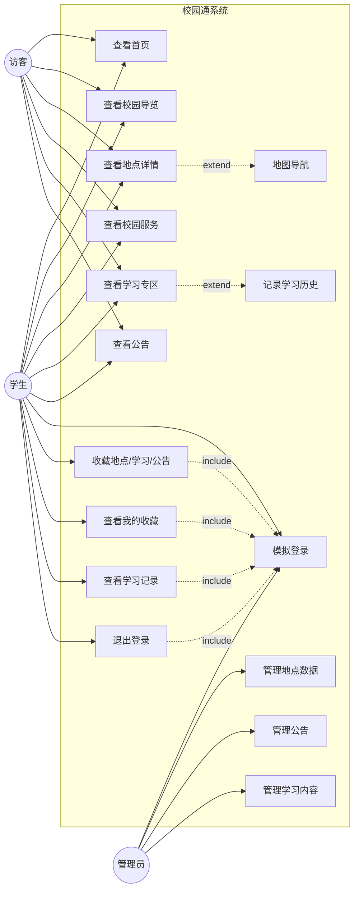

用例关系说明：

| 关系类型 | 说明 |
|---|---|
| `<<include>>` | 收藏、查看收藏、查看学习记录、退出登录均**必须**先完成"模拟登录" |
| `<<extend>>` | 查看地点详情时**可选**触发"地图导航"；查看学习专区时**可选**触发"记录学习历史" |

---

## 3.3 用户故事

为了更清晰地表达用户需求，本项目从不同用户角度设计以下用户故事。

| 编号 | 用户故事 |
|---|---|
| US001 | 作为一名学生，我希望能够快速查看图书馆、食堂、教学楼等地点信息，以便节省查找时间。 |
| US002 | 作为一名新生，我希望通过地图查看校园建筑位置，以便更快熟悉校园环境。 |
| US003 | 作为一名课程学习者，我希望查看 WXML、WXSS、小程序 API 等学习内容，以便复习课程知识。 |
| US004 | 作为一名学生用户，我希望收藏常用地点和学习内容，以便下次快速查看。 |
| US005 | 作为访客用户，我希望查看学校简介和校园导览，以便了解校园基本情况。 |
| US006 | 作为项目开发成员，我希望通过该项目体现小程序组件、API 和设计模式的使用，以便满足课程考核要求。 |

---

## 3.4 用户权限分析

| 功能 | 访客用户 | 学生用户 | 管理员 |
|---|---:|---:|---:|
| 查看首页 | √ | √ | √ |
| 查看校园导览 | √ | √ | √ |
| 查看地点详情 | √ | √ | √ |
| 查看校园服务 | √ | √ | √ |
| 查看学习专区 | √ | √ | √ |
| 收藏地点 | × | √ | √ |
| 收藏学习内容 | × | √ | √ |
| 查看个人中心 | × | √ | √ |
| 查看学习记录 | × | √ | √ |
| 管理公告 | × | × | √（P2 可选） |
| 管理地点数据 | × | × | √（P2 可选） |
| 管理学习内容 | × | × | √（P2 可选） |

说明：课程作业阶段，管理员功能为轻量模拟管理员模式，通过"`admin001` 学号特殊识别 + 前端路由隐藏入口"实现身份识别和管理入口展示，不开发独立后台系统，不要求完整实现增删改查功能。管理员 CRUD 功能为 P2 可选扩展。

---

# 第四章 功能需求分析

## 4.1 功能优先级划分

为保证项目按时完成，需要对功能进行优先级划分。文档中各模块子功能沿用星级标注：`★★★★★` = P0 核心（必须完成），`★★★★☆` = P1 重要（应该完成），`★★★☆☆` = P2 扩展（时间允许完成）。

### 4.1.1 必须完成模块

| 模块 | 说明 |
|---|---|
| 首页模块 | 展示项目入口、学校简介、公告和功能导航 |
| 校园导览模块 | 展示校园建筑列表和地图位置 |
| 地点详情模块 | 展示建筑详情、开放时间、位置等信息 |
| 前端学习专区模块 | 展示课程学习内容和代码示例 |
| 个人中心模块 | 实现模拟登录、用户信息展示 |
| 收藏功能 | 实现地点、学习内容等信息的收藏 |

### 4.1.2 可选扩展模块

| 模块 | 说明 |
|---|---|
| 公告通知模块 | 展示校园公告和活动提醒 |
| 校园服务搜索 | 根据关键词搜索图书馆、食堂、教室等服务 |
| 学习记录统计 | 统计用户浏览过的学习内容 |
| 后台管理功能 | 管理地点、公告和学习内容 |
| 云数据库存储 | 将本地数据升级为云数据库存储 |

---

## 4.2 首页模块

首页是小程序的入口页面，主要用于展示学校信息、公告入口和核心功能导航。

### 4.2.1 功能说明

| 子功能 | 功能描述 | 优先级 |
|---|---|---|
| 学校信息展示 | 展示学校名称、项目名称、校园简介 | ★★★★★ |
| 轮播图展示 | 展示校园图片或功能宣传图 | ★★★★☆ |
| 功能入口导航 | 提供校园导览、校园服务、学习专区、个人中心入口 | ★★★★★ |
| 最新公告展示 | 展示最近几条校园公告 | ★★★★☆ |
| 推荐学习内容 | 推荐前端学习专区中的知识点 | ★★★☆☆ |

### 4.2.2 页面内容

```text
首页页面内容：

1. 顶部轮播图
2. 项目名称：校园通
3. 学校简介
4. 四个主要功能入口：
   - 校园导览
   - 校园服务
   - 学习专区
   - 个人中心
5. 最新公告列表
6. 推荐学习内容
```

---

## 4.3 校园导览模块

校园导览模块用于展示校园建筑、位置和详情信息。

### 4.3.1 功能说明

| 子功能 | 功能描述 | 优先级 |
|---|---|---|
| 建筑列表 | 展示图书馆、教学楼、食堂、宿舍区、操场等地点 | ★★★★★ |
| 建筑分类 | 按学习场所、生活场所、运动场所等分类展示 | ★★★★☆ |
| 地点详情 | 展示建筑名称、简介、开放时间、位置等 | ★★★★★ |
| 地图定位 | 使用微信小程序地图组件展示地点位置 | ★★★★★ |
| 地点收藏 | 用户可收藏常用地点 | ★★★★☆ |

### 4.3.2 地点信息字段

| 字段名 | 说明 |
|---|---|
| id | 地点编号 |
| name | 地点名称 |
| type | 地点类型 |
| description | 地点介绍 |
| openTime | 开放时间 |
| latitude | 纬度 |
| longitude | 经度 |
| image | 地点图片 |
| isFavorite | 是否收藏 |

---

## 4.4 校园服务模块

校园服务模块用于展示校园常用服务信息。

### 4.4.1 功能说明

| 子功能 | 功能描述 | 优先级 |
|---|---|---|
| 图书馆服务 | 展示图书馆位置、开放时间、服务内容 | ★★★★☆ |
| 食堂服务 | 展示食堂位置、营业时间、简介 | ★★★★☆ |
| 教室信息 | 展示教学楼、教室类型、使用说明 | ★★★☆☆ |
| 校园活动 | 展示校园活动名称、时间、地点 | ★★★★☆ |
| 服务搜索 | 根据关键词搜索服务信息 | ★★★☆☆ |

### 4.4.2 服务信息字段

| 字段名 | 说明 |
|---|---|
| id | 服务编号 |
| title | 服务名称 |
| type | 服务类型 |
| location | 服务地点 |
| time | 服务时间 |
| content | 服务说明 |
| contact | 联系方式，可为空 |

---

## 4.5 前端学习专区模块

前端学习专区用于展示《前端框架应用技术》课程相关内容，是本项目区别于普通校园导览小程序的重要功能。

### 4.5.1 功能说明

| 子功能 | 功能描述 | 优先级 |
|---|---|---|
| 知识点列表 | 展示 WXML、WXSS、JS、小程序 API 等内容 | ★★★★★ |
| 学习详情 | 展示知识点说明和代码示例 | ★★★★★ |
| API 示例 | 展示 wx.request、wx.setStorage、wx.navigateTo 等 API 示例 | ★★★★☆ |
| 设计模式学习 | 展示单例模式、观察者模式的使用场景 | ★★★★☆ |
| 学习记录 | 记录用户浏览过的学习内容 | ★★★★☆ |
| 收藏学习内容 | 收藏常用知识点 | ★★★★☆ |

### 4.5.2 学习内容分类

| 分类 | 内容 |
|---|---|
| 页面结构 | WXML 基础、view、text、image、scroll-view 等组件 |
| 页面样式 | WXSS、flex 布局、响应式布局 |
| 页面逻辑 | JavaScript、Page 对象、data 数据绑定 |
| 生命周期 | onLoad、onShow、onReady、onHide、onUnload |
| 小程序 API | wx.request、wx.setStorage、wx.getStorage、wx.navigateTo、wx.showToast |
| 设计模式 | 单例模式、观察者模式 |

---

## 4.6 公告通知模块

公告通知模块用于展示校园公告和活动提醒。

### 4.6.1 功能说明

| 子功能 | 功能描述 | 优先级 |
|---|---|---|
| 公告列表 | 展示公告标题、发布时间、类型 | ★★★★☆ |
| 公告详情 | 查看公告完整内容 | ★★★★☆ |
| 活动提醒 | 展示校园活动提醒 | ★★★☆☆ |
| 公告收藏 | 收藏重要公告 | ★★★☆☆ |

### 4.6.2 公告信息字段

| 字段名 | 说明 |
|---|---|
| id | 公告编号 |
| title | 公告标题 |
| type | 公告类型 |
| content | 公告内容 |
| date | 发布时间 |
| publisher | 发布者 |
| isTop | 是否置顶 |

---

## 4.7 个人中心模块

个人中心模块用于展示用户信息、收藏记录、学习记录和登录状态。

### 4.7.1 功能说明

| 子功能 | 功能描述 | 优先级 |
|---|---|---|
| 模拟登录 | 用户输入学号或点击按钮完成模拟登录 | ★★★★★ |
| 用户信息展示 | 展示昵称、学院、专业等信息 | ★★★★☆ |
| 我的收藏 | 展示收藏的地点、公告和学习内容 | ★★★★☆ |
| 学习记录 | 展示浏览过的学习内容 | ★★★★☆ |
| 退出登录 | 清除登录状态 | ★★★☆☆ |

---

# 第五章 非功能需求分析

## 5.1 性能需求

| 项目 | 量化指标 |
|---|---|
| 首页首屏渲染 | 冷启动 ≤ 2s，热启动 ≤ 1s |
| 列表翻页渲染 | 滑动加载 ≤ 200ms，单页不少于 60fps |
| 本地缓存读写 | 单次 `storage.get/set` ≤ 50ms |
| 地图组件加载 | 首次定位 ≤ 2s，标记点渲染 ≤ 500ms |
| 页面跳转 | `navigateTo` 响应 ≤ 300ms |
| 网络请求超时 | 默认 5s，超时后走本地缓存兜底 |
| 安装包体积 | 主包 ≤ 2MB，符合小程序 2MB 主包限制 |

## 5.2 易用性需求

| 项目 | 要求 |
|---|---|
| 界面布局 | 页面结构清晰，功能入口明显 |
| 操作方式 | 点击、跳转、收藏等操作简单直接 |
| 提示反馈 | 收藏、取消收藏、登录、退出等操作需要有提示 |
| 页面风格 | 颜色统一，符合校园服务类小程序风格 |
| 学习体验 | 学习内容应分类清晰，代码示例便于阅读 |

## 5.3 安全性需求

| 项目 | 要求 |
|---|---|
| 隐私保护 | 不存储真实学生隐私信息 |
| 登录数据 | 使用模拟用户数据，不接入真实教务系统 |
| 数据权限 | 访客用户不能访问个人中心和收藏功能 |
| 信息来源 | 校园信息使用公开信息或模拟数据 |
| 数据安全 | 本地缓存只保存课程展示所需的模拟数据 |

## 5.4 可维护性需求

| 项目 | 要求 |
|---|---|
| 数据维护 | 地点、公告、学习内容应独立存放在 data 文件中 |
| 代码结构 | 页面文件、工具函数、数据文件分离 |
| 注释规范 | 关键逻辑需要添加注释 |
| 功能扩展 | 后续可扩展后台管理、活动报名、预约等功能 |
| 页面复用 | 公告详情、学习详情、地点详情等页面可通过 id 参数复用 |

---

# 第六章 真实校园内容使用说明

本项目可以使用公开的校园信息作为展示内容，例如学校名称、学院名称、校园建筑名称、图书馆、食堂、教学楼等公开信息。

为保护隐私和避免误解，项目在使用真实学校内容时应遵循以下原则：

| 内容类型 | 是否建议使用 | 说明 |
|---|---|---|
| 学校名称 | 可以使用 | 可用于项目背景和页面展示 |
| 学院名称 | 可以使用 | 可展示计算机学院等公开信息 |
| 校园建筑名称 | 可以使用 | 如图书馆、教学楼、食堂、宿舍区等 |
| 图书馆、食堂开放时间 | 可以使用 | 建议使用公开信息或模拟信息 |
| 学生真实姓名和学号 | 不建议使用 | 涉及个人隐私 |
| 教师私人联系方式 | 不建议使用 | 涉及个人隐私 |
| 学校内部系统账号 | 禁止使用 | 涉及安全问题 |
| 未公开通知文件 | 不建议使用 | 不适合作为公开展示内容 |

项目首页或说明页面可加入以下提示：

```text
本小程序为课程学习项目，仅用于校园信息展示与前端学习实践，不代表学校官方平台。
```

---

# 第七章 系统总体设计

## 7.1 总体设计思路

本项目采用微信小程序原生开发框架进行开发，整体设计采用“表现层、业务逻辑层、数据层”的分层结构。

系统前端通过 WXML 完成页面结构设计，通过 WXSS 完成页面样式设计，通过 JavaScript 完成页面交互逻辑，通过 JSON 完成页面配置。数据部分主要采用本地模拟数据和微信小程序缓存 API 实现，后期可扩展为云开发数据库或后端接口。

## 7.2 系统总体架构

系统按"表现层—业务逻辑层—数据层"三层进行组织，各层之间通过明确的接口进行交互，便于后续维护和扩展。

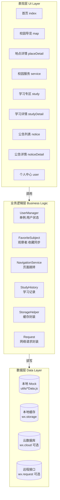

## 7.3 架构说明

| 层级 | 说明 |
|---|---|
| 表现层 | 负责页面展示，包括首页、导览页、服务页、学习页和个人中心 |
| 业务逻辑层 | 负责用户登录、收藏、学习记录、页面跳转、数据筛选等逻辑 |
| 数据层 | 负责提供校园地点、公告、学习内容和用户缓存数据 |

---

# 第八章 系统功能结构设计

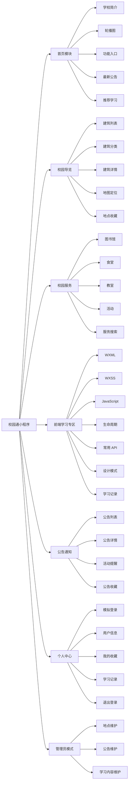

---

# 第九章 页面设计方案

## 9.1 导航结构与 TabBar 设计

小程序采用"tabBar + 二级页面跳转"的混合导航结构，一级功能固化在底部 tabBar，便于用户在核心模块之间快速切换；详情、登录等二级页面通过 `wx.navigateTo` 进入。

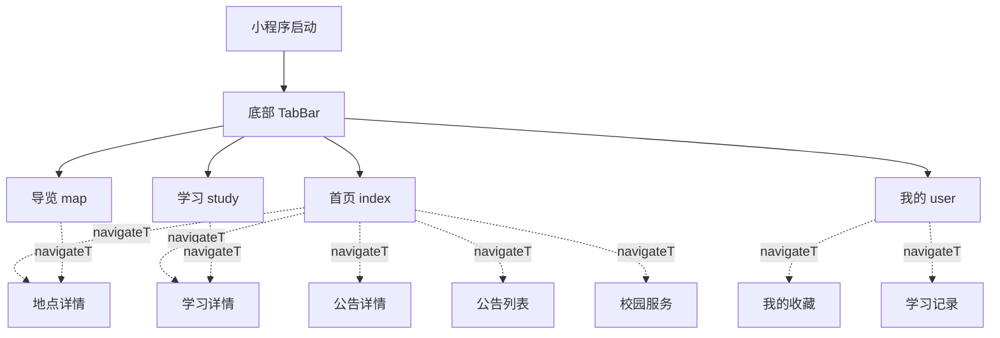

`app.json` tabBar 配置示例：

```json
{
  "tabBar": {
    "color": "#888",
    "selectedColor": "#1aad19",
    "backgroundColor": "#ffffff",
    "list": [
      { "pagePath": "pages/index/index", "text": "首页", "iconPath": "images/tab/home.png", "selectedIconPath": "images/tab/home-on.png" },
      { "pagePath": "pages/map/map", "text": "导览", "iconPath": "images/tab/map.png", "selectedIconPath": "images/tab/map-on.png" },
      { "pagePath": "pages/study/study", "text": "学习", "iconPath": "images/tab/study.png", "selectedIconPath": "images/tab/study-on.png" },
      { "pagePath": "pages/user/user", "text": "我的", "iconPath": "images/tab/user.png", "selectedIconPath": "images/tab/user-on.png" }
    ]
  }
}
```

---

## 9.2 自定义组件设计

为提升代码复用性和可维护性，将多页面共享的 UI 片段抽成自定义组件，体现小程序组件化开发能力。

| 组件 | 使用位置 | 说明 |
|---|---|---|
| `place-card` | 首页、校园导览、我的收藏 | 校园地点卡片，展示图片、名称、类型、开放时间 |
| `study-card` | 首页、学习专区、我的收藏 | 学习内容卡片，展示标题、分类、摘要 |
| `notice-item` | 首页、公告列表 | 公告条目，展示标题、时间、类型、置顶标识 |
| `favorite-btn` | 地点详情、学习详情、公告详情 | 收藏按钮，内部订阅 FavoriteSubject 自动同步状态 |
| `section-header` | 首页、各列表页 | 统一风格的分区标题 |
| `empty-state` | 我的收藏、学习记录 | 空状态占位 |

组件目录示例：

```text
components/
├── place-card/
│   ├── place-card.wxml
│   ├── place-card.wxss
│   ├── place-card.js
│   └── place-card.json
├── study-card/
├── notice-item/
├── favorite-btn/
├── section-header/
└── empty-state/
```

`favorite-btn` 组件核心字段和事件：

| properties | 类型 | 说明 |
|---|---|---|
| type | String | 收藏类型，place / study / notice |
| targetId | Number | 目标 ID |
| title | String | 收藏标题 |

组件在 `attached` 生命周期中向 FavoriteSubject 注册自己，在 `detached` 中注销，收藏状态变化时自动更新，无需页面手动同步。

### 组件通信方式

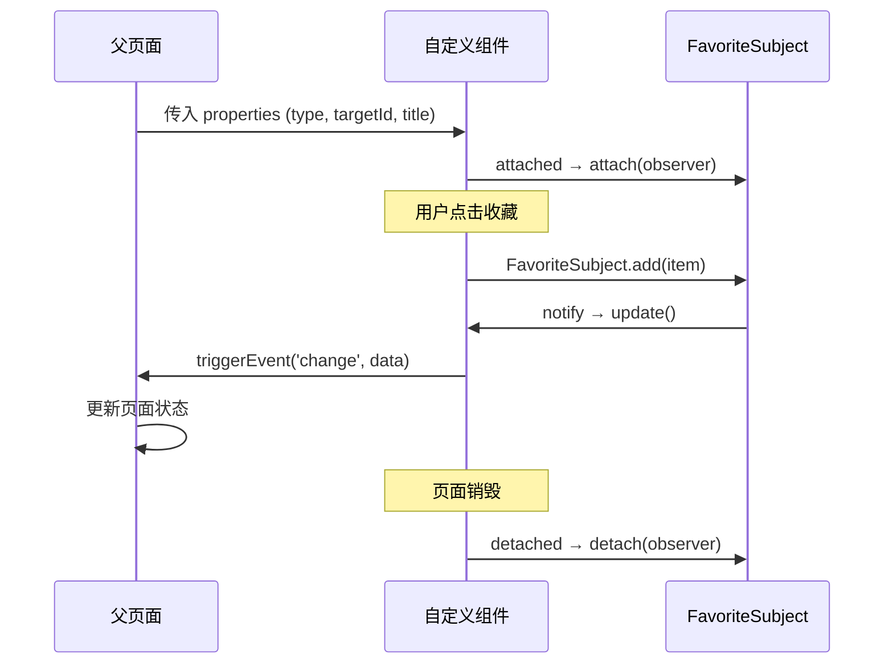

| 通信方向 | 方式 | 示例 |
|---|---|---|
| 父 → 子 | `properties` 传值 | `<favorite-btn type="place" targetId="{{item.id}}" />` |
| 子 → 父 | `triggerEvent` 事件 | `this.triggerEvent('change', { isFavorite: true })` |
| 父监听子 | `bind:xxx` | `<favorite-btn bind:change="onFavChange" />` |
| 跨组件 | 观察者模式（FavoriteSubject） | 任意组件/页面 attach 后自动收到通知 |

---

## 9.3 全局状态设计

项目在 `app.js` 和若干工具模块中维护全局状态，页面通过 `getApp()` 或模块 require 方式访问。

| 位置 | 存放内容 | 访问方式 |
|---|---|---|
| `app.js` globalData | 主题色、版本号、是否管理员、当前网络状态 | `getApp().globalData` |
| `utils/userManager.js` | 用户登录状态单例（见 14.1） | `require + UserManager.xxx` |
| `utils/favoriteSubject.js` | 收藏事件中心（见 14.2） | `require + FavoriteSubject.xxx` |
| `utils/storage.js` | 本地缓存统一读写 | `require + storage.get/set` |

`app.js` 启动时完成以下工作：

```js
// app.js
const UserManager = require('./utils/userManager.js')

App({
  globalData: {
    version: '1.0.0',
    themeColor: '#1aad19',
    isAdmin: false,
    networkType: 'unknown'
  },

  onLaunch() {
    // 同步一次登录状态
    UserManager.syncFromStorage()
    this.globalData.isAdmin = UserManager.getUserInfo()?.role === 'admin'

    // 监听网络变化
    wx.onNetworkStatusChange(res => {
      this.globalData.networkType = res.networkType
    })
  }
})
```

页面 `onShow` 时再从 `UserManager` 同步最新用户状态，避免跨页登录/退出后信息不一致。

---

## 9.4 页面目录设计

```text
miniprogram
│
├── pages
│   ├── index              首页
│   ├── map                校园导览
│   ├── placeDetail        地点详情
│   ├── service            校园服务
│   ├── study              学习专区
│   ├── studyDetail        学习详情
│   ├── notice             公告列表
│   ├── noticeDetail       公告详情
│   ├── user               个人中心
│   ├── favorite           我的收藏
│   └── studyHistory       学习记录
│
├── components
│   ├── place-card
│   ├── study-card
│   ├── notice-item
│   ├── favorite-btn
│   ├── section-header
│   └── empty-state
│
├── utils
│   ├── placeData.js
│   ├── serviceData.js
│   ├── studyData.js
│   ├── noticeData.js
│   ├── userData.js
│   ├── userManager.js     单例:用户状态
│   ├── favoriteSubject.js 观察者:收藏同步
│   ├── studyHistoryHelper.js 学习记录工具
│   ├── request.js         请求封装
│   └── storage.js         缓存封装
│
├── images
│   ├── tab                tabBar 图标
│   ├── places             地点图片
│   └── avatar             头像占位
│
├── app.js
├── app.json
└── app.wxss
```

## 9.5 页面功能设计

| 页面 | 功能说明 |
|---|---|
| 首页 `index` | 展示学校简介、轮播图、功能入口、最新公告、推荐学习内容 |
| 校园导览 `map` | 展示建筑列表和地图位置 |
| 地点详情 `placeDetail` | 展示建筑详情、开放时间、位置、收藏按钮 |
| 校园服务 `service` | 展示图书馆、食堂、教室、校园活动信息 |
| 学习专区 `study` | 展示前端课程学习内容列表 |
| 学习详情 `studyDetail` | 展示知识点详情、代码示例、收藏按钮、代码一键复制 |
| 公告列表 `notice` | 展示校园公告和活动通知 |
| 公告详情 `noticeDetail` | 展示公告完整内容 |
| 个人中心 `user` | 模拟登录、用户信息、收藏入口、学习记录入口、退出登录 |
| 我的收藏 `favorite` | 展示收藏的地点、学习、公告（tab 切换） |
| 学习记录 `studyHistory` | 展示最近浏览的学习内容 |

## 9.6 页面跳转关系图

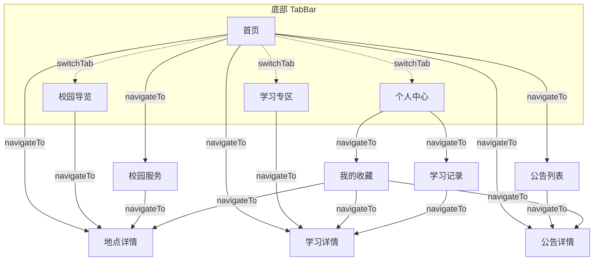

说明：实线箭头为 `wx.navigateTo`（可返回），虚线箭头为 `wx.switchTab`（切换 tabBar 页）。所有详情页均通过 URL 参数 `?id=xxx` 传递目标数据 ID。

## 9.7 WXSS 设计规范

为保证全项目视觉一致性，统一以下样式规范，写入 `app.wxss` 作为全局变量：

### 9.7.1 色彩规范

| 用途 | 变量名 | 色值 | 说明 |
|---|---|---|---|
| 主色 | `--primary` | `#1aad19` | 微信绿，用于按钮、tabBar 选中、链接 |
| 辅色 | `--secondary` | `#576b95` | 用于次要操作、标签 |
| 警告色 | `--danger` | `#fa5151` | 用于删除、退出登录 |
| 背景色 | `--bg` | `#f6f6f6` | 页面底色 |
| 卡片色 | `--card-bg` | `#ffffff` | 卡片/列表项背景 |
| 主文字 | `--text-primary` | `#333333` | 标题、正文 |
| 辅文字 | `--text-secondary` | `#888888` | 描述、时间 |
| 分割线 | `--border` | `#eeeeee` | 列表分割线 |

### 9.7.2 字体与间距规范

| 层级 | 字号 | 行高 | 使用场景 |
|---|---|---|---|
| 大标题 | 36rpx | 1.4 | 页面标题 |
| 标题 | 32rpx | 1.4 | 卡片标题、分区标题 |
| 正文 | 28rpx | 1.6 | 列表内容、详情正文 |
| 辅助 | 24rpx | 1.5 | 时间、标签、描述 |
| 小字 | 20rpx | 1.4 | 角标、提示 |

| 间距 | 数值 | 使用场景 |
|---|---|---|
| xs | 8rpx | 图标与文字间距 |
| sm | 16rpx | 列表项内部间距 |
| md | 24rpx | 卡片内边距 |
| lg | 32rpx | 分区之间间距 |
| xl | 48rpx | 页面顶部/底部留白 |

### 9.7.3 圆角与阴影

| 元素 | 圆角 | 阴影 |
|---|---|---|
| 卡片 | 16rpx | `0 2rpx 12rpx rgba(0,0,0,0.05)` |
| 按钮 | 8rpx | 无 |
| 头像 | 50%（圆形） | 无 |
| 输入框 | 8rpx | 内阴影 `inset 0 1rpx 4rpx rgba(0,0,0,0.05)` |

### 9.7.4 全局样式片段

```css
/* app.wxss 全局变量与基础样式 */
page {
  --primary: #1aad19;
  --secondary: #576b95;
  --danger: #fa5151;
  --bg: #f6f6f6;
  --card-bg: #ffffff;
  --text-primary: #333333;
  --text-secondary: #888888;
  --border: #eeeeee;

  font-size: 28rpx;
  color: var(--text-primary);
  background-color: var(--bg);
  line-height: 1.6;
}

.card {
  background: var(--card-bg);
  border-radius: 16rpx;
  padding: 24rpx;
  margin: 16rpx 24rpx;
  box-shadow: 0 2rpx 12rpx rgba(0,0,0,0.05);
}

.section-title {
  font-size: 32rpx;
  font-weight: bold;
  padding: 24rpx 24rpx 16rpx;
}

.btn-primary {
  background: var(--primary);
  color: #fff;
  border-radius: 8rpx;
  text-align: center;
  padding: 16rpx 0;
}
```

## 9.8 完整 app.json 配置

```json
{
  "pages": [
    "pages/index/index",
    "pages/map/map",
    "pages/study/study",
    "pages/user/user",
    "pages/placeDetail/placeDetail",
    "pages/studyDetail/studyDetail",
    "pages/service/service",
    "pages/notice/notice",
    "pages/noticeDetail/noticeDetail",
    "pages/favorite/favorite",
    "pages/studyHistory/studyHistory"
  ],
  "window": {
    "navigationBarBackgroundColor": "#1aad19",
    "navigationBarTitleText": "校园通",
    "navigationBarTextStyle": "white",
    "backgroundColor": "#f6f6f6",
    "backgroundTextStyle": "dark"
  },
  "tabBar": {
    "color": "#888888",
    "selectedColor": "#1aad19",
    "backgroundColor": "#ffffff",
    "borderStyle": "white",
    "list": [
      {
        "pagePath": "pages/index/index",
        "text": "首页",
        "iconPath": "images/tab/home.png",
        "selectedIconPath": "images/tab/home-on.png"
      },
      {
        "pagePath": "pages/map/map",
        "text": "导览",
        "iconPath": "images/tab/map.png",
        "selectedIconPath": "images/tab/map-on.png"
      },
      {
        "pagePath": "pages/study/study",
        "text": "学习",
        "iconPath": "images/tab/study.png",
        "selectedIconPath": "images/tab/study-on.png"
      },
      {
        "pagePath": "pages/user/user",
        "text": "我的",
        "iconPath": "images/tab/user.png",
        "selectedIconPath": "images/tab/user-on.png"
      }
    ]
  },
  "permission": {
    "scope.userLocation": {
      "desc": "用于校园导览地图定位功能"
    }
  },
  "requiredPrivateInfos": ["getLocation"],
  "style": "v2",
  "sitemapLocation": "sitemap.json"
}
```

---

# 第十章 页面原型设计

## 10.1 首页页面原型

```text
┌──────────────────────────┐
│        校园轮播图          │
├──────────────────────────┤
│  校园通                    │
│  智慧校园与前端学习服务平台 │
├──────────────────────────┤
│  校园导览  校园服务        │
│  学习专区  个人中心        │
├──────────────────────────┤
│        最新公告            │
│  - 关于课程设计提交的通知   │
│  - 校园活动报名通知         │
├──────────────────────────┤
│      推荐学习内容           │
│  WXML 基础 / 小程序 API     │
└──────────────────────────┘
```

## 10.2 校园导览页面原型

```text
┌──────────────────────────┐
│          地图区域          │
│      显示校园建筑标记       │
├──────────────────────────┤
│  分类：全部 学习 生活 运动  │
├──────────────────────────┤
│  图书馆                    │
│  开放时间：08:00-22:00     │
├──────────────────────────┤
│  第一教学楼                │
│  开放时间：07:30-22:00     │
└──────────────────────────┘
```

## 10.3 地点详情页面原型

```text
┌──────────────────────────┐
│        建筑图片            │
├──────────────────────────┤
│  图书馆                    │
│  类型：学习场所             │
│  开放时间：08:00-22:00     │
├──────────────────────────┤
│  地点介绍                  │
│  提供图书借阅、自习等服务    │
├──────────────────────────┤
│      [收藏地点]             │
└──────────────────────────┘
```

## 10.4 学习专区页面原型

```text
┌──────────────────────────┐
│        前端学习专区         │
├──────────────────────────┤
│  分类：结构 样式 逻辑 API   │
├──────────────────────────┤
│  WXML 基础                 │
│  页面结构语言               │
├──────────────────────────┤
│  wx.setStorage 本地缓存     │
│  保存用户数据               │
└──────────────────────────┘
```

## 10.5 个人中心页面原型

```text
┌──────────────────────────┐
│        用户头像            │
│        张三 / 学生用户      │
├──────────────────────────┤
│  我的收藏                  │
│  学习记录                  │
│  关于项目                  │
├──────────────────────────┤
│        [退出登录]           │
└──────────────────────────┘
```

---

# 第十一章 数据结构设计

## 11.1 用户信息数据结构

```js
const userInfo = {
  id: 1,
  studentId: "20260001",
  name: "张三",
  college: "计算机学院",
  major: "软件工程",
  role: "student",
  avatar: "/images/avatar.png"
}
```

## 11.2 校园地点数据结构

说明：经纬度以广州应用科技学院（肇庆校区）中心点约 `23.06, 112.46` 为基准，实际开发时以腾讯地图拾取工具采集的真实坐标替换。

```js
const placeList = [
  {
    id: 1,
    name: "图书馆",
    type: "学习场所",
    description: "图书馆主要提供图书借阅、自习、电子资源查询等服务。",
    openTime: "08:00-22:00",
    latitude: 23.0601,
    longitude: 112.4621,
    image: "/images/places/library.jpg"
  },
  {
    id: 2,
    name: "第一教学楼",
    type: "教学场所",
    description: "第一教学楼主要用于日常课程教学和实验实训。",
    openTime: "07:30-22:00",
    latitude: 23.0615,
    longitude: 112.4630,
    image: "/images/places/building1.jpg"
  }
]
```

## 11.3 校园服务数据结构

```js
const serviceList = [
  {
    id: 1,
    title: "图书馆服务",
    type: "学习服务",
    location: "图书馆",
    time: "08:00-22:00",
    content: "提供图书借阅、自习座位、电子资源查询等服务。"
  },
  {
    id: 2,
    title: "食堂服务",
    type: "生活服务",
    location: "学生食堂",
    time: "07:00-20:00",
    content: "提供早餐、午餐、晚餐等餐饮服务。"
  }
]
```

## 11.4 学习内容数据结构

```js
const studyList = [
  {
    id: 1,
    title: "WXML 基础",
    category: "页面结构",
    summary: "WXML 是微信小程序的页面结构语言，类似于 HTML。",
    content: "WXML 用于描述小程序页面结构，常见组件包括 view、text、image 等。",
    code: "<view class='box'>这是一个容器</view>"
  },
  {
    id: 2,
    title: "wx.setStorage 本地缓存",
    category: "小程序 API",
    summary: "wx.setStorage 用于将数据存储到本地缓存中。",
    content: "在用户登录、收藏、学习记录等场景中，可以使用 wx.setStorage 保存数据。",
    code: "wx.setStorage({ key: 'userInfo', data: userInfo })"
  }
]
```

## 11.5 公告数据结构

```js
const noticeList = [
  {
    id: 1,
    title: "关于期末课程设计提交的通知",
    type: "课程通知",
    content: "请各小组按要求提交项目源代码、设计说明书、答辩 PPT 和讲解视频。",
    date: "2026-05-12",
    publisher: "计算机学院",
    isTop: true
  },
  {
    id: 2,
    title: "校园活动报名通知",
    type: "活动通知",
    content: "学校将举办校园科技文化活动，欢迎同学们积极参与。",
    date: "2026-05-15",
    publisher: "学生工作处",
    isTop: false
  }
]
```

## 11.6 收藏数据结构

```js
const favoriteItem = {
  id: 1,
  type: "place",
  title: "图书馆",
  targetId: 1,
  createTime: "2026-05-12"
}
```

---

# 第十二章 数据库与本地存储设计

## 12.1 数据分层策略

本项目采用"Mock 数据 + 本地缓存 + 网络请求封装"三层策略，支持从课程作业阶段平滑升级到正式上线阶段，兼顾"可答辩"与"可扩展"。

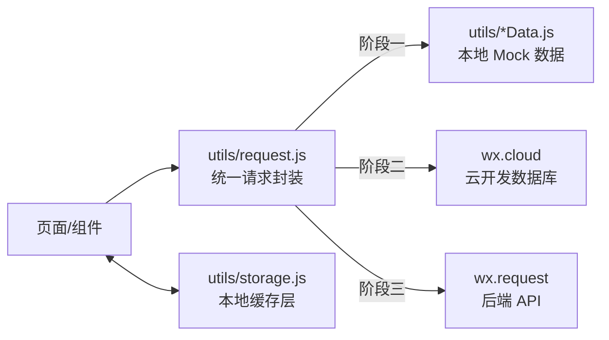

| 阶段 | 数据来源 | 使用场景 |
|---|---|---|
| 阶段一（课程作业） | `utils/*Data.js` Mock + `wx.storage` 缓存 | 答辩展示、离线可跑 |
| 阶段二（云开发） | `wx.cloud` 云数据库 + 云函数 | 真实持久化、多人协作维护 |
| 阶段三（正式上线） | 后端服务 + `wx.request` | 接入学校统一身份认证、正式运维 |

请求层对页面透明：`getPlaceList()` 在阶段一从 Mock 返回，在阶段二/三切换底层实现即可，不影响页面代码。课程作业阶段通过 `request.js` 使用 Promise + setTimeout 模拟完整的"请求 → loading → 数据返回 → 错误兜底"链路，体现 wx.request 的使用思路。后续可选扩展阶段可接入真实公开 API（如和风天气）作为真实网络请求示例。

## 12.2 本地数据文件设计

| 文件名 | 作用 |
|---|---|
| `utils/placeData.js` | 存放校园地点 Mock 数据 |
| `utils/serviceData.js` | 存放校园服务 Mock 数据 |
| `utils/studyData.js` | 存放前端学习内容 Mock 数据 |
| `utils/noticeData.js` | 存放公告通知 Mock 数据 |
| `utils/userData.js` | 存放模拟用户数据 |
| `utils/request.js` | 统一请求封装，切换 Mock / 云开发 / 真实 API |
| `utils/storage.js` | 本地缓存统一封装 |

## 12.3 本地缓存设计

| 缓存 key | 说明 |
|---|---|
| `userInfo` | 当前登录用户信息 |
| `isLogin` | 用户是否登录 |
| `favoriteList` | 用户收藏记录 |
| `studyHistory` | 用户学习记录 |
| `noticeReadList` | 用户已读公告记录 |
| `noticeCache` | 公告列表缓存，接口失败时兜底 |
| `settings` | 用户偏好配置（主题、字体大小等） |

## 12.4 实体关系图（ER 图）

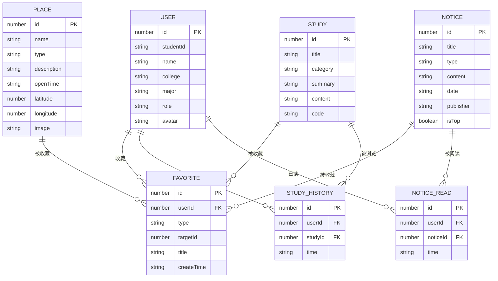

## 12.5 数据表设计

说明：阶段一以上述 schema 作为本地 Mock 数据结构约束；阶段二/三在云数据库或关系型数据库中按此 schema 建集合/建表。

### 12.5.1 用户表 User

| 字段名 | 类型 | 说明 |
|---|---|---|
| id | Number | 用户编号 |
| studentId | String | 学号 |
| name | String | 姓名 |
| college | String | 学院 |
| major | String | 专业 |
| role | String | 用户角色 |

### 12.5.2 地点表 Place

| 字段名 | 类型 | 说明 |
|---|---|---|
| id | Number | 地点编号 |
| name | String | 地点名称 |
| type | String | 地点类型 |
| description | String | 地点介绍 |
| openTime | String | 开放时间 |
| latitude | Number | 纬度 |
| longitude | Number | 经度 |
| image | String | 图片路径 |

### 12.5.3 学习内容表 Study

| 字段名 | 类型 | 说明 |
|---|---|---|
| id | Number | 内容编号 |
| title | String | 标题 |
| category | String | 分类 |
| summary | String | 简介 |
| content | String | 详细内容 |
| code | String | 示例代码 |

### 12.5.4 收藏表 Favorite

| 字段名 | 类型 | 说明 |
|---|---|---|
| id | Number | 收藏编号 |
| userId | Number | 用户编号 |
| type | String | 收藏类型 |
| targetId | Number | 目标编号 |
| title | String | 收藏标题 |
| createTime | String | 收藏时间 |

## 12.6 云开发数据库设计（阶段二）

升级到云开发时，按下表在微信云开发控制台建立集合。集合名与阶段一 Mock 文件一一对应，便于请求层切换。

| 集合名 | 主要字段 | 索引建议 |
|---|---|---|
| `users` | `_id, studentId, name, college, major, role, avatar, createTime` | `studentId` 唯一索引 |
| `places` | `_id, name, type, description, openTime, latitude, longitude, image, sortIndex` | `type` 普通索引 |
| `services` | `_id, title, type, location, time, content, contact` | `type` 普通索引 |
| `studies` | `_id, title, category, summary, content, code, order` | `category, order` 组合索引 |
| `notices` | `_id, title, type, content, date, publisher, isTop` | `isTop desc, date desc` 组合索引 |
| `favorites` | `_id, userId, type, targetId, title, createTime` | `userId + type + targetId` 组合索引，防重复 |
| `studyHistory` | `_id, userId, studyId, title, time` | `userId, time desc` 组合索引 |

权限说明：`users`/`favorites`/`studyHistory` 设置为"仅创建者可读写"；`places`/`services`/`studies`/`notices` 设置为"所有用户可读，仅管理员可写"。

## 12.7 请求层封装

所有页面通过 `utils/request.js` 获取数据，不直接依赖具体数据源，切换数据源时只改一个文件。

```js
// utils/request.js
const DATA_SOURCE = 'mock' // 'mock' | 'cloud' | 'api'

const mockData = {
  places: require('./placeData.js'),
  services: require('./serviceData.js'),
  studies: require('./studyData.js'),
  notices: require('./noticeData.js')
}

function fetchList(name) {
  if (DATA_SOURCE === 'mock') {
    return new Promise(resolve => {
      setTimeout(() => resolve({ code: 0, message: 'success', data: { list: mockData[name], total: mockData[name].length } }), 200)
    })
  }
  if (DATA_SOURCE === 'cloud') {
    return wx.cloud.database().collection(name).get().then(res => {
      return { code: 0, message: 'success', data: { list: res.data, total: res.data.length } }
    })
  }
  return new Promise((resolve, reject) => {
    wx.request({
      url: `https://api.example.com/${name}`,
      success: res => resolve(res.data),
      fail: reject
    })
  })
}

module.exports = {
  getPlaceList: () => fetchList('places'),
  getServiceList: () => fetchList('services'),
  getStudyList: () => fetchList('studies'),
  getNoticeList: () => fetchList('notices')
}
```

## 12.8 本地缓存封装 storage.js

所有页面通过 `utils/storage.js` 读写缓存，统一处理异常和默认值，避免缓存损坏导致页面白屏。

```js
// utils/storage.js

/**
 * 读取缓存，支持默认值和异常兜底
 * @param {string} key 缓存键名
 * @param {*} defaultValue 默认值，缓存不存在或损坏时返回
 * @returns {*}
 */
function get(key, defaultValue = null) {
  try {
    const value = wx.getStorageSync(key)
    if (value === '' || value === undefined || value === null) {
      return defaultValue
    }
    return value
  } catch (e) {
    console.warn('[storage] get error:', key, e)
    return defaultValue
  }
}

/**
 * 写入缓存
 * @param {string} key 缓存键名
 * @param {*} data 要存储的数据
 * @returns {boolean} 是否写入成功
 */
function set(key, data) {
  try {
    wx.setStorageSync(key, data)
    return true
  } catch (e) {
    console.error('[storage] set error:', key, e)
    wx.showToast({ title: '数据保存失败', icon: 'none' })
    return false
  }
}

/**
 * 删除缓存
 * @param {string} key 缓存键名
 */
function remove(key) {
  try {
    wx.removeStorageSync(key)
  } catch (e) {
    console.warn('[storage] remove error:', key, e)
  }
}

/**
 * 清空所有缓存（退出登录时使用）
 */
function clear() {
  try {
    wx.clearStorageSync()
  } catch (e) {
    console.error('[storage] clear error:', e)
  }
}

/**
 * 获取缓存信息（调试用）
 */
function info() {
  try {
    return wx.getStorageInfoSync()
  } catch (e) {
    return { keys: [], currentSize: 0, limitSize: 0 }
  }
}

module.exports = { get, set, remove, clear, info }
```

---

# 第十三章 核心模块设计

## 13.1 登录模块设计

### 13.1.1 功能说明

登录模块采用模拟登录方式，不接入真实学校系统。用户点击登录按钮后，将模拟用户信息保存到本地缓存中。

### 13.1.2 实现流程

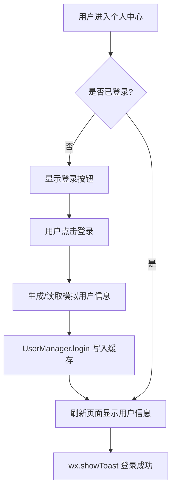

### 13.1.3 关键 API

| API | 作用 |
|---|---|
| `wx.setStorageSync` | 保存用户登录信息 |
| `wx.getStorageSync` | 获取用户登录状态 |
| `wx.removeStorageSync` | 退出登录时清除缓存 |
| `wx.showToast` | 登录成功或退出提示 |

---

## 13.2 收藏模块设计

### 13.2.1 功能说明

收藏模块用于收藏校园地点、学习内容和公告通知。用户点击收藏按钮后，系统将收藏信息保存到本地缓存中。

### 13.2.2 实现流程

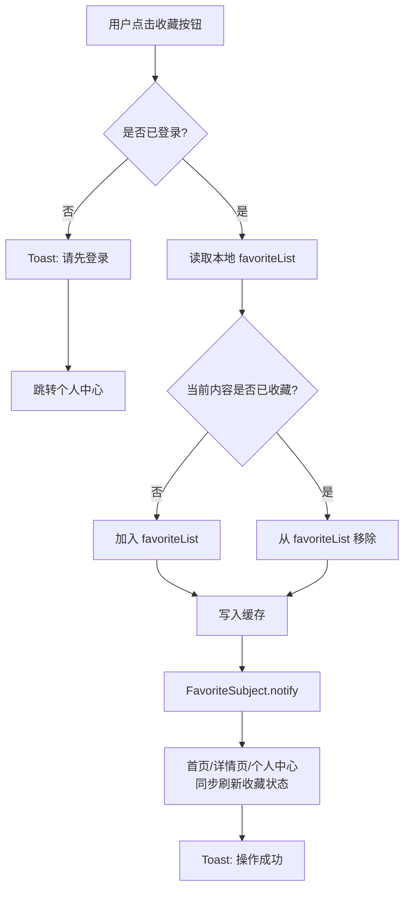

### 13.2.3 收藏判断逻辑

```js
const favoriteList = wx.getStorageSync('favoriteList') || []

const isFavorite = favoriteList.some(item => {
  return item.type === type && item.targetId === targetId
})
```

---

## 13.3 校园导览模块设计

### 13.3.1 功能说明

校园导览模块通过地点列表和地图组件展示校园主要建筑。用户可以点击地点查看详情，也可以在地图上查看建筑位置。

### 13.3.2 地图标记数据

```js
const markers = placeList.map(item => {
  return {
    id: item.id,
    latitude: item.latitude,
    longitude: item.longitude,
    title: item.name
  }
})
```

### 13.3.3 使用组件

| 组件 | 作用 |
|---|---|
| `map` | 显示校园地图 |
| `scroll-view` | 显示可滚动建筑列表 |
| `image` | 显示建筑图片 |
| `button` | 收藏、跳转等操作 |

---

## 13.4 学习专区模块设计

### 13.4.1 功能说明

学习专区用于展示课程学习内容。用户可以查看知识点列表，进入详情页查看说明和代码示例。

### 13.4.2 实现流程

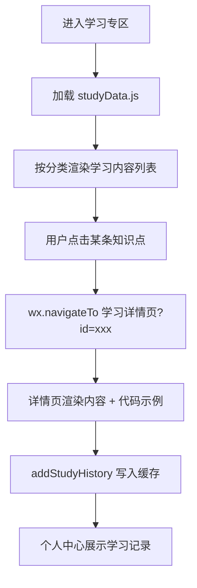

### 13.4.3 学习记录逻辑

```js
function addStudyHistory(item) {
  let history = wx.getStorageSync('studyHistory') || []

  history = history.filter(h => h.id !== item.id)

  history.unshift({
    id: item.id,
    title: item.title,
    time: new Date().toLocaleString()
  })

  wx.setStorageSync('studyHistory', history)
}
```

---

## 13.5 公告通知模块设计

### 13.5.1 功能说明

公告通知模块展示校园通知、课程通知和活动通知。首页展示最新公告，公告页面展示完整列表，公告详情页展示完整内容。

### 13.5.2 实现流程

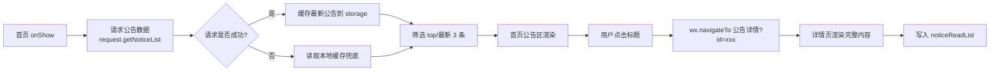

---

# 第十四章 设计模式应用方案

## 14.1 单例模式

### 14.1.1 应用场景

单例模式用于统一管理用户登录状态和全局缓存数据，避免多个页面重复创建用户状态管理对象。

### 14.1.2 作用

| 作用 | 说明 |
|---|---|
| 统一管理用户信息 | 所有页面都从同一个用户管理对象中获取登录状态 |
| 减少重复代码 | 登录、退出、读取用户信息逻辑集中处理 |
| 提高维护性 | 后续修改用户状态逻辑时，只需修改一个文件 |

### 14.1.3 类图设计

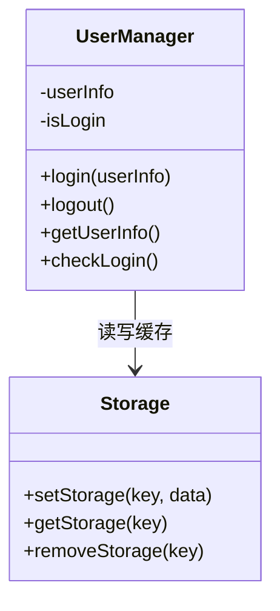

### 14.1.4 示例代码

```js
// utils/userManager.js
const UserManager = {
  getUserInfo() {
    return wx.getStorageSync('userInfo') || null
  },

  isLogin() {
    return wx.getStorageSync('isLogin') || false
  },

  login(userInfo) {
    wx.setStorageSync('userInfo', userInfo)
    wx.setStorageSync('isLogin', true)
  },

  logout() {
    wx.removeStorageSync('userInfo')
    wx.setStorageSync('isLogin', false)
  }
}

module.exports = UserManager
```

---

## 14.2 观察者模式

### 14.2.1 应用场景

观察者模式用于**收藏状态跨页面实时同步**。典型场景：用户在地点详情页点击收藏后，需要同步刷新首页的"我的收藏"数量、个人中心的收藏列表 tab 徽标、以及其他页面的爱心图标状态。

相比"被动 onShow 重新读缓存"，观察者模式可以做到"点一下，所有订阅页面立即刷新"，减少重复查询逻辑。

### 14.2.2 作用

| 作用 | 说明 |
|---|---|
| 解耦收藏逻辑与页面展示 | 收藏按钮组件只通知 Subject，不关心有多少订阅者 |
| 实时同步多个页面 | 一次收藏操作，所有订阅页面立即更新 |
| 便于扩展 | 后续加"收藏数变化红点提醒"、"消息订阅"等功能只需新增 Observer |
| 避免缓存不一致 | 所有页面从同一事件源获取收藏变化，不会出现缓存读不到的情况 |

### 14.2.3 类图设计

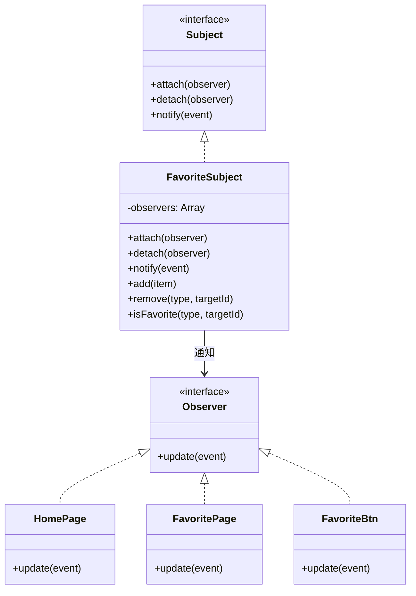

### 14.2.4 交互时序

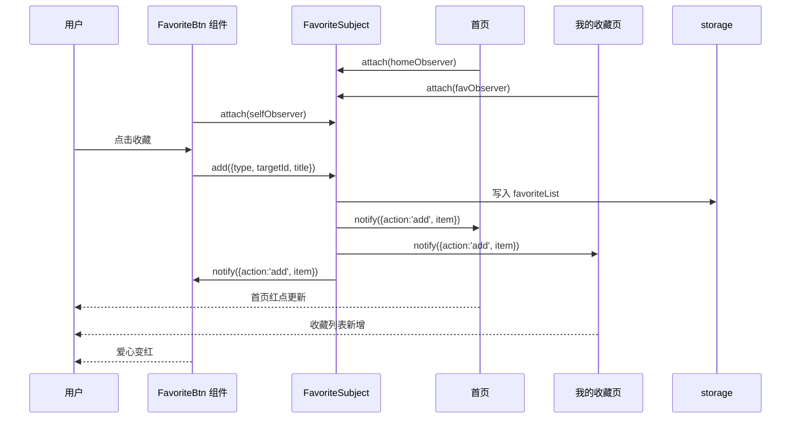

### 14.2.5 示例代码

```js
// utils/favoriteSubject.js
const storage = require('./storage.js')

const FavoriteSubject = {
  observers: [],

  attach(observer) {
    if (!this.observers.includes(observer)) {
      this.observers.push(observer)
    }
  },

  detach(observer) {
    this.observers = this.observers.filter(item => item !== observer)
  },

  notify(event) {
    this.observers.forEach(observer => {
      if (typeof observer.update === 'function') {
        observer.update(event)
      }
    })
  },

  add(item) {
    const list = storage.get('favoriteList', [])
    if (list.some(i => i.type === item.type && i.targetId === item.targetId)) return
    list.unshift({ ...item, createTime: new Date().toLocaleString() })
    storage.set('favoriteList', list)
    this.notify({ action: 'add', item })
  },

  remove(type, targetId) {
    const list = storage.get('favoriteList', [])
    const next = list.filter(i => !(i.type === type && i.targetId === targetId))
    storage.set('favoriteList', next)
    this.notify({ action: 'remove', item: { type, targetId } })
  },

  isFavorite(type, targetId) {
    const list = storage.get('favoriteList', [])
    return list.some(i => i.type === type && i.targetId === targetId)
  }
}

module.exports = FavoriteSubject
```

页面中使用示例：

```js
// pages/index/index.js
const FavoriteSubject = require('../../utils/favoriteSubject.js')

Page({
  data: { favoriteCount: 0 },

  onLoad() {
    this.observer = {
      update: (event) => {
        this.setData({
          favoriteCount: wx.getStorageSync('favoriteList')?.length || 0
        })
      }
    }
    FavoriteSubject.attach(this.observer)
    this.observer.update()
  },

  onUnload() {
    FavoriteSubject.detach(this.observer)
  }
})
```

---

# 第十五章 技术实现方案

## 15.1 开发环境

| 工具 | 说明 |
|---|---|
| 微信开发者工具 | 小程序开发、调试、预览、上传 |
| Visual Studio Code | 代码编辑工具 |
| 微信小程序原生框架 | 项目主要开发框架 |
| WXML | 页面结构 |
| WXSS | 页面样式 |
| JavaScript | 页面逻辑 |
| JSON | 页面配置 |
| 本地缓存 API | 保存登录状态、收藏记录、学习记录 |

## 15.2 主要技术点

| 技术点 | 使用场景 |
|---|---|
| 数据绑定 | 页面展示地点、公告、学习内容 |
| 条件渲染 | 判断用户是否登录、是否收藏 |
| 列表渲染 | 展示建筑列表、公告列表、学习内容列表 |
| 页面跳转 | 首页跳转到各功能页面 |
| 本地缓存 | 保存用户信息、收藏记录、学习记录 |
| 地图组件 | 展示校园建筑位置 |
| 模拟数据 | 存放地点、服务、公告、学习内容 |
| 设计模式 | 单例模式管理用户状态，观察者模式实现收藏状态跨页面同步 |

## 15.3 技术点与功能对应关系

| 技术点 | 应用位置 | 作用 |
|---|---|---|
| WXML | 所有页面 | 搭建页面结构 |
| WXSS | 所有页面 | 设置页面样式 |
| JavaScript | 页面逻辑 | 实现数据绑定、跳转、收藏等功能 |
| swiper 组件 | 首页 | 展示校园轮播图 |
| map 组件 | 校园导览页 | 展示校园地点 |
| scroll-view 组件 | 列表页面 | 实现滚动列表 |
| wx.navigateTo | 页面跳转 | 跳转到详情页面 |
| wx.setStorage | 收藏、登录 | 保存本地数据 |
| wx.getStorage | 个人中心 | 读取用户信息和收藏记录 |
| wx.showToast | 操作反馈 | 提示登录、收藏成功等信息 |
| wx.request | 网络请求 | 通过 request.js 模拟完整请求链路（loading + 数据返回 + 错误兜底）；可选扩展阶段可对接真实公开 API |
| wx.cloud（可选） | 云开发 | 阶段二升级时用云数据库替换 Mock，实现真实持久化 |
| Component | 自定义组件 | 封装 place-card / study-card / favorite-btn 等 6 个复用组件 |

## 15.4 页面跳转设计

```js
wx.navigateTo({
  url: '/pages/placeDetail/placeDetail?id=' + id
})
```

适用场景：

| 跳转来源 | 跳转目标 |
|---|---|
| 首页功能入口 | 校园导览、校园服务、学习专区、个人中心 |
| 建筑列表 | 地点详情页 |
| 学习列表 | 学习详情页 |
| 公告列表 | 公告详情页 |
| 个人中心 | 我的收藏、学习记录 |

## 15.5 数据缓存设计

### 保存登录信息

```js
wx.setStorageSync('userInfo', userInfo)
wx.setStorageSync('isLogin', true)
```

### 读取登录状态

```js
const isLogin = wx.getStorageSync('isLogin') || false
const userInfo = wx.getStorageSync('userInfo') || null
```

### 保存收藏

```js
wx.setStorageSync('favoriteList', favoriteList)
```

### 读取收藏

```js
const favoriteList = wx.getStorageSync('favoriteList') || []
```

## 15.6 模拟请求设计

课程作业阶段可以使用本地数据，也可以通过封装函数模拟 `wx.request` 的请求效果。

```js
function getNoticeList() {
  return new Promise(resolve => {
    setTimeout(() => {
      resolve(noticeList)
    }, 300)
  })
}
```

也可以在可选扩展阶段使用真实 `wx.request` 接入公开接口（如"和风天气"等公开开放 API 作为真实网络请求示例）。以下为扩展阶段的接入示例（P2 可选，课程作业阶段不要求必须实现）：

```js
// utils/request.js 片段
function requestWithFallback(url, cacheKey) {
  return new Promise(resolve => {
    wx.request({
      url,
      method: 'GET',
      timeout: 5000,
      success: res => {
        if (res.statusCode === 200) {
          wx.setStorageSync(cacheKey, res.data)
          resolve({ data: res.data, fromCache: false })
        } else {
          resolve({ data: wx.getStorageSync(cacheKey), fromCache: true })
        }
      },
      fail: () => {
        // 网络异常兜底
        resolve({ data: wx.getStorageSync(cacheKey), fromCache: true })
      }
    })
  })
}

module.exports = {
  getWeather: () => requestWithFallback(
    'https://devapi.qweather.com/v7/weather/now?location=101280901&key=YOUR_KEY',
    'weatherCache'
  )
}
```

页面中使用：

```js
// pages/index/index.js
const request = require('../../utils/request.js')

Page({
  onLoad() {
    wx.showLoading({ title: '加载中' })
    request.getWeather().then(res => {
      wx.hideLoading()
      this.setData({ weather: res.data })
      if (res.fromCache) {
        wx.showToast({ title: '网络异常，展示缓存', icon: 'none' })
      }
    })
  }
})
```

该封装体现完整的"请求 → loading → 成功渲染 → 失败兜底 → 用户提示"链路，涵盖考核要求的网络请求 API、加载状态、异常处理、本地缓存配合等知识点。

## 15.7 关键代码实现

本节展示项目中最核心的 5 段代码，每段标注所用知识点，便于答辩时快速定位。

### 15.7.1 首页 onLoad — 数据加载与渲染

```js
// pages/index/index.js
const request = require('../../utils/request.js')
const storage = require('../../utils/storage.js')
const FavoriteSubject = require('../../utils/favoriteSubject.js')

Page({
  data: {
    banners: [],        // 轮播图
    notices: [],        // 最新公告
    recommends: [],     // 推荐学习
    favoriteCount: 0    // 收藏数
  },

  onLoad() {
    this.loadBanners()
    this.loadNotices()
    this.loadRecommends()

    // 观察者模式：订阅收藏变化
    this.favObserver = {
      update: () => {
        const list = storage.get('favoriteList', [])
        this.setData({ favoriteCount: list.length })
      }
    }
    FavoriteSubject.attach(this.favObserver)
    this.favObserver.update()
  },

  onUnload() {
    FavoriteSubject.detach(this.favObserver)
  },

  // 知识点：wx:for 列表渲染 + 数据绑定
  loadBanners() {
    this.setData({
      banners: [
        { id: 1, image: '/images/banner1.jpg' },
        { id: 2, image: '/images/banner2.jpg' },
        { id: 3, image: '/images/banner3.jpg' }
      ]
    })
  },

  // 知识点：Promise + 异步数据加载
  loadNotices() {
    request.getNoticeList().then(list => {
      this.setData({ notices: list.filter(n => n.isTop).slice(0, 3) })
    })
  },

  loadRecommends() {
    request.getStudyList().then(list => {
      this.setData({ recommends: list.slice(0, 4) })
    })
  },

  // 知识点：wx.navigateTo 页面跳转 + 参数传递
  goDetail(e) {
    const { type, id } = e.currentTarget.dataset
    wx.navigateTo({ url: `/pages/${type}/${type}?id=${id}` })
  }
})
```

**涉及知识点：** 数据绑定、列表渲染、页面跳转、Promise 异步、观察者模式订阅。

### 15.7.2 地图标记生成 — map 组件

```js
// pages/map/map.js
const request = require('../../utils/request.js')

Page({
  data: {
    latitude: 23.0601,   // 校园中心纬度
    longitude: 112.4621, // 校园中心经度
    scale: 16,
    markers: [],
    places: [],
    activeType: '全部'
  },

  onLoad() {
    request.getPlaceList().then(list => {
      this.allPlaces = list
      this.setData({
        places: list,
        markers: this.buildMarkers(list)
      })
    })
  },

  // 知识点：Array.map 数据转换
  buildMarkers(list) {
    return list.map(item => ({
      id: item.id,
      latitude: item.latitude,
      longitude: item.longitude,
      title: item.name,
      iconPath: '/images/marker.png',
      width: 30,
      height: 30,
      callout: {
        content: item.name,
        display: 'ALWAYS',
        fontSize: 12,
        borderRadius: 4,
        padding: 4
      }
    }))
  },

  // 知识点：条件渲染 + 数据筛选
  filterByType(e) {
    const type = e.currentTarget.dataset.type
    this.setData({ activeType: type })
    const filtered = type === '全部'
      ? this.allPlaces
      : this.allPlaces.filter(p => p.type === type)
    this.setData({
      places: filtered,
      markers: this.buildMarkers(filtered)
    })
  },

  // 知识点：地图标记点击事件
  onMarkerTap(e) {
    const id = e.markerId
    wx.navigateTo({ url: `/pages/placeDetail/placeDetail?id=${id}` })
  }
})
```

**涉及知识点：** map 组件、markers 配置、Array.map/filter、条件渲染、事件处理。

### 15.7.3 收藏按钮组件 — Component + 观察者模式

```js
// components/favorite-btn/favorite-btn.js
const FavoriteSubject = require('../../utils/favoriteSubject.js')
const UserManager = require('../../utils/userManager.js')

Component({
  properties: {
    type: { type: String, value: '' },       // place / study / notice
    targetId: { type: Number, value: 0 },
    title: { type: String, value: '' }
  },

  data: {
    isFavorite: false
  },

  lifetimes: {
    attached() {
      // 初始化状态
      this.checkFavorite()
      // 注册观察者
      this.observer = {
        update: () => this.checkFavorite()
      }
      FavoriteSubject.attach(this.observer)
    },
    detached() {
      FavoriteSubject.detach(this.observer)
    }
  },

  methods: {
    checkFavorite() {
      const { type, targetId } = this.properties
      this.setData({
        isFavorite: FavoriteSubject.isFavorite(type, targetId)
      })
    },

    onTap() {
      if (!UserManager.isLogin()) {
        wx.showToast({ title: '请先登录', icon: 'none' })
        return
      }
      const { type, targetId, title } = this.properties
      if (this.data.isFavorite) {
        FavoriteSubject.remove(type, targetId)
        wx.showToast({ title: '已取消收藏', icon: 'none' })
      } else {
        FavoriteSubject.add({ type, targetId, title })
        wx.showToast({ title: '收藏成功', icon: 'success' })
      }
      // triggerEvent 通知父页面（可选）
      this.triggerEvent('change', { isFavorite: !this.data.isFavorite })
    }
  }
})
```

**涉及知识点：** 自定义组件 Component、properties、lifetimes、观察者模式、triggerEvent 组件通信。

### 15.7.4 学习记录写入 — 本地缓存操作

```js
// utils/studyHistoryHelper.js
const storage = require('./storage.js')

const MAX_HISTORY = 20 // 最多保留 20 条

/**
 * 添加学习记录（去重 + 限制条数）
 * 知识点：wx.setStorageSync、Array 操作、时间格式化
 */
function addStudyHistory(item) {
  let history = storage.get('studyHistory', [])

  // 去重：如果已存在则移到最前面
  history = history.filter(h => h.id !== item.id)

  // 插入到头部
  history.unshift({
    id: item.id,
    title: item.title,
    category: item.category,
    time: formatTime(new Date())
  })

  // 限制条数
  if (history.length > MAX_HISTORY) {
    history = history.slice(0, MAX_HISTORY)
  }

  storage.set('studyHistory', history)
}

function formatTime(date) {
  const y = date.getFullYear()
  const m = String(date.getMonth() + 1).padStart(2, '0')
  const d = String(date.getDate()).padStart(2, '0')
  const h = String(date.getHours()).padStart(2, '0')
  const min = String(date.getMinutes()).padStart(2, '0')
  return `${y}-${m}-${d} ${h}:${min}`
}

function getStudyHistory() {
  return storage.get('studyHistory', [])
}

function clearStudyHistory() {
  storage.remove('studyHistory')
}

module.exports = { addStudyHistory, getStudyHistory, clearStudyHistory }
```

**涉及知识点：** 本地缓存 API、数组去重、条数限制、时间格式化、模块导出。

### 15.7.5 模拟登录 — 单例模式 + 条件渲染

```js
// pages/user/user.js
const UserManager = require('../../utils/userManager.js')
const userData = require('../../utils/userData.js')

Page({
  data: {
    isLogin: false,
    userInfo: null
  },

  onShow() {
    // 每次显示时从单例同步状态（防止其他页面退出登录后不一致）
    this.setData({
      isLogin: UserManager.isLogin(),
      userInfo: UserManager.getUserInfo()
    })
  },

  // 模拟登录：使用预设用户数据
  handleLogin() {
    const user = userData.defaultUser
    UserManager.login(user)
    this.setData({ isLogin: true, userInfo: user })
    wx.showToast({ title: '登录成功', icon: 'success' })
  },

  // 管理员模式：特殊学号触发
  handleAdminLogin() {
    const admin = userData.adminUser
    UserManager.login(admin)
    this.setData({ isLogin: true, userInfo: admin })
    getApp().globalData.isAdmin = true
    wx.showToast({ title: '管理员模式', icon: 'success' })
  },

  handleLogout() {
    wx.showModal({
      title: '提示',
      content: '确定退出登录吗？',
      success: (res) => {
        if (res.confirm) {
          UserManager.logout()
          getApp().globalData.isAdmin = false
          this.setData({ isLogin: false, userInfo: null })
          wx.showToast({ title: '已退出', icon: 'none' })
        }
      }
    })
  }
})
```

**涉及知识点：** 单例模式（UserManager）、onShow 生命周期、条件渲染（登录前/后双态）、wx.showModal 交互确认、globalData。

## 15.8 代码规范

| 规范项 | 约定 |
|---|---|
| 文件命名 | 页面目录 camelCase（如 `placeDetail`），组件目录 kebab-case（如 `place-card`） |
| 变量命名 | camelCase，常量 UPPER_SNAKE_CASE |
| 函数命名 | 动词开头：`getXxx`、`setXxx`、`handleXxx`、`onXxx` |
| 缩进 | 2 空格 |
| 引号 | JS 中统一单引号，JSON 中双引号 |
| 注释 | 关键函数使用 JSDoc 风格，复杂逻辑行内注释 |
| 每行长度 | 建议不超过 120 字符 |
| 组件 properties | 必须声明类型和默认值 |
| 页面 data | 初始值不能为 undefined，必须给明确默认值 |
| 事件绑定 | 统一使用 `bind:xxx`，不混用 `bindxxx` 和 `bind:xxx` |

---

# 第十六章 测试方案

## 16.1 功能测试

| 测试模块 | 测试内容 | 预期结果 |
|---|---|---|
| 首页 | 点击功能入口 | 能正常跳转到对应页面 |
| 校园导览 | 查看建筑列表 | 能正常显示建筑信息 |
| 地点详情 | 点击地点 | 能进入详情页并显示对应内容 |
| 地图组件 | 打开地图页面 | 能显示地图和标记点 |
| 学习专区 | 查看知识点 | 能进入学习详情页 |
| 收藏功能 | 点击收藏 | 能保存收藏状态 |
| 个人中心 | 点击登录 | 能显示用户信息 |
| 退出登录 | 点击退出 | 能清除登录状态 |
| 公告模块 | 点击公告 | 能查看公告详情 |

## 16.2 测试用例

| 编号 | 测试功能 | 测试步骤 | 预期结果 | 实际结果 |
|---|---|---|---|---|
| TC001 | 首页跳转 | 点击校园导览入口 | 正常进入校园导览页 | 通过 |
| TC002 | 地点详情 | 点击图书馆卡片 | 显示图书馆详情 | 通过 |
| TC003 | 收藏地点 | 登录后点击收藏 | 提示收藏成功，个人中心可查看 | 通过 |
| TC004 | 取消收藏 | 再次点击收藏按钮 | 取消收藏成功 | 通过 |
| TC005 | 学习记录 | 点击学习内容详情 | 个人中心显示学习记录 | 通过 |
| TC006 | 退出登录 | 点击退出登录按钮 | 清除用户信息 | 通过 |
| TC007 | 公告详情 | 点击公告标题 | 进入公告详情页面 | 通过 |
| TC008 | 地图显示 | 进入校园导览页面 | 地图和地点标记正常显示 | 通过 |

## 16.3 兼容性测试

| 测试对象 | 测试内容 |
|---|---|
| 微信开发者工具 | 页面是否正常运行 |
| Android 手机微信 | 页面显示、跳转、缓存是否正常 |
| iPhone 手机微信 | 页面显示、跳转、缓存是否正常 |
| 不同屏幕尺寸 | 页面布局是否错乱 |

## 16.4 缓存测试

| 测试内容 | 预期结果 |
|---|---|
| 登录后关闭小程序再打开 | 用户登录状态仍然存在 |
| 收藏地点后重新进入页面 | 收藏状态仍然存在 |
| 退出登录后进入个人中心 | 用户信息被清除 |
| 学习详情浏览后查看学习记录 | 学习记录正常显示 |

## 16.5 异常与边界测试

| 编号 | 场景 | 触发方式 | 预期行为 |
|---|---|---|---|
| EX001 | 无网络请求公告 | 开发者工具切换"离线" | 读取 `noticeCache` 兜底，顶部提示"网络异常，展示历史数据" |
| EX002 | 接口返回空数组 | Mock 返回 `[]` | 列表区显示 empty-state 组件，不出现空白错位 |
| EX003 | 定位授权被拒 | 地图页拒绝授权 | 展示校园默认坐标，提示"可在设置中开启定位" |
| EX004 | 缓存数据损坏 | 手动将 `favoriteList` 写入非数组 | `storage.get` 返回默认值 `[]`，页面正常渲染 |
| EX005 | 未登录点击收藏 | 退出登录后点详情页收藏 | Toast 提示"请先登录"，不写入缓存 |
| EX006 | 重复收藏 | 连续点击同一条 2 次 | FavoriteSubject.add 去重，缓存只保留 1 条 |
| EX007 | 超长文本 | 公告内容 5000+ 字 | 详情页可滚动，不溢出 |
| EX008 | 学习记录超限 | 浏览超过 50 条学习内容 | 仅保留最近 20 条 |
| EX009 | 地图标记重叠 | 两地点经纬度相同 | 标记仍可点击，点击弹出选择面板 |
| EX010 | 小屏手机适配 | iPhone SE 等 320px 屏幕 | 首页功能入口不换行错位 |

## 16.6 Bug 记录与解决（开发过程沉淀）

开发过程中记录的典型 Bug，用于答辩讲解"技术挑战与解决过程"。

| 编号 | Bug 现象 | 定位过程 | 解决方案 |
|---|---|---|---|
| BUG001 | 地图组件加载后标记不显示 | 打印 markers 发现 latitude 为字符串 | Mock 数据中经纬度统一转为 Number 类型 |
| BUG002 | 收藏后返回首页徽标不更新 | onShow 会重读但切 tab 时未触发 | 引入观察者模式，收藏变更时主动 notify |
| BUG003 | iOS 真机 scroll-view 滑动卡顿 | scroll-view 嵌套过深 | 去掉外层 view 的 flex，改用 page-meta 控制 |
| BUG004 | 学习详情代码块样式错位 | WXSS 中 white-space 未设置 | 添加 `white-space: pre; overflow-x: auto` |
| BUG005 | 退出登录后个人中心仍显示头像 | 页面 data 未同步 | onShow 中从 UserManager 重新读取并 setData |
| BUG006 | 请求层 Mock 和云开发切换时字段名不一致 | `_id` vs `id` | 请求层统一映射：云开发返回数据前做字段适配 |

## 16.7 真机测试截图清单（Word 版提交时补贴图）

最终提交 Word 设计说明书时，建议每页至少 1 张真机截图：

- 首页（轮播 + 功能入口）
- 校园导览（地图 + 列表）
- 地点详情（收藏前/后对比）
- 学习专区（分类切换）
- 学习详情（代码高亮）
- 公告列表 + 公告详情
- 个人中心（登录前/后对比）
- 我的收藏（tab 切换）
- 学习记录
- 异常态（无网络提示、空状态）

## 16.8 调试方法与工具

| 调试工具/面板 | 用途 | 使用场景 |
|---|---|---|
| AppData 面板 | 实时查看页面 data 数据 | 检查 setData 是否生效、数据结构是否正确 |
| Storage 面板 | 查看/修改本地缓存 | 验证登录状态、收藏列表、学习记录是否正确写入 |
| Network 面板 | 查看网络请求详情 | 检查 wx.request 的 URL、参数、返回值、状态码 |
| Console 面板 | 查看 console.log 输出 | 打印变量值、追踪代码执行流程 |
| WXML 面板 | 查看页面 DOM 结构 | 定位样式问题、检查条件渲染是否生效 |
| 真机调试 | 手机端实时调试 | 解决开发工具与真机表现不一致的问题 |
| 断点调试 | Sources 面板设置断点 | 逐行执行代码，定位逻辑错误 |

调试流程建议：

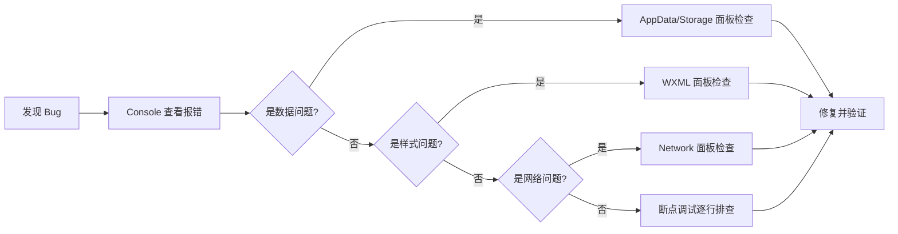

## 16.9 性能优化记录

| 编号 | 优化项 | 优化前 | 优化后 | 方法 |
|---|---|---|---|---|
| OPT001 | 首页图片加载 | 首屏 2.1s | 首屏 1.4s | image 组件添加 `lazy-load` 属性，非首屏图片延迟加载 |
| OPT002 | 列表渲染性能 | 滑动偶尔卡顿 | 流畅 60fps | `wx:for` 添加 `wx:key="id"`，避免 diff 时全量重渲染 |
| OPT003 | 地图标记计算 | 每次 setData 重建 | 仅筛选时重建 | markers 在 onLoad 一次性计算，筛选时从缓存数组 filter |
| OPT004 | setData 数据量 | 整个列表 setData | 按需更新 | 收藏状态变化时只 setData 变化的字段，不刷新整个列表 |
| OPT005 | 包体积控制 | 图片未压缩 1.8MB | 压缩后 1.1MB | 所有图片使用 TinyPNG 压缩，tabBar 图标使用 48x48 尺寸 |
| OPT006 | 缓存读取频率 | 每个页面 onShow 都读 | 按需读取 | 通过观察者模式主动推送变化，减少 storage 读取次数 |

---

# 第十七章 系统运行截图占位

正式提交 Word 文档时按本章的截图清单在对应位置插入真机截图，与测试章 16.7 清单一致。

## 17.1 必需截图清单

| 编号 | 位置 | 截图要求 |
|---|---|---|
| S01 | 首页 | 含轮播图 + 功能入口 + 最新公告 + 天气接口实时数据 |
| S02 | 校园导览 | 地图组件 + 标记点 + 建筑列表 |
| S03 | 地点详情 | 建筑图片 + 开放时间 + 收藏前后对比 |
| S04 | 校园服务 | 服务分类列表 |
| S05 | 学习专区 | 分类切换 + 知识点列表 |
| S06 | 学习详情 | 代码示例高亮 + 一键复制按钮 |
| S07 | 公告列表 | 置顶公告 + 普通公告 |
| S08 | 公告详情 | 完整内容 + 收藏按钮 |
| S09 | 个人中心 | 未登录 + 登录后双态对比 |
| S10 | 我的收藏 | tab 切换（地点/学习/公告） |
| S11 | 学习记录 | 最近浏览列表 |
| S12 | 异常态 | 无网络提示、空状态 |
| S13 | 管理员模式 | `admin001` 登录后的管理入口 |

---

# 第十八章 部署方案

## 18.1 课程作业部署流程

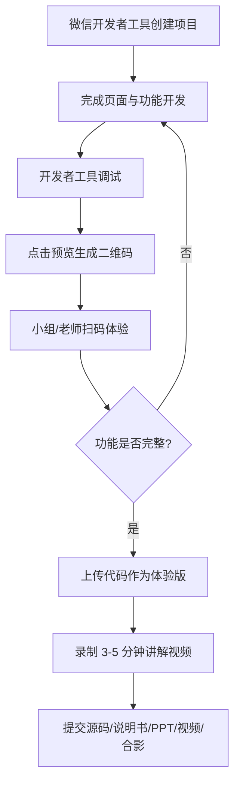

## 18.2 正式上线部署流程

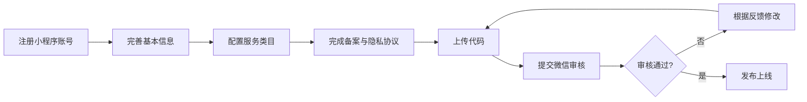

本课程项目建议优先完成“可运行、可展示、可答辩”的体验版，不建议一开始就追求正式上线。

---

# 第十九章 项目分工方案

## 19.1 二人小组分工

| 成员 | 负责模块 | 具体工作 |
|---|---|---|
| 成员 A | 首页、校园导览、地点详情、个人中心、收藏 | 整体页面框架、tabBar、地图组件、模拟登录、FavoriteSubject、UserManager |
| 成员 B | 校园服务、学习专区、学习详情、公告、文档 | 学习内容整理、代码示例、公告模块、wx.request 接入、测试用例、设计说明书、PPT、讲解视频 |

## 19.2 三人小组分工

| 成员 | 负责模块 | 具体工作 |
|---|---|---|
| 成员 A | 首页、个人中心 | 首页布局、功能入口、模拟登录、用户信息、退出登录 |
| 成员 B | 校园导览、地点详情 | 建筑列表、地图组件、地点详情、地点收藏 |
| 成员 C | 学习专区、公告、文档 | 学习内容列表、学习详情、公告列表、设计说明书、PPT |

## 19.3 四人小组分工

| 成员 | 负责模块 | 具体工作 |
|---|---|---|
| 成员 A | 首页、个人中心 | 首页设计、登录功能、个人信息、退出登录 |
| 成员 B | 校园导览 | 建筑列表、地图定位、地点详情 |
| 成员 C | 校园服务、公告通知 | 图书馆、食堂、活动、公告列表和详情 |
| 成员 D | 学习专区、测试文档 | 学习内容、代码示例、收藏、测试、PPT、视频讲解 |

---

# 第二十章 项目进度计划

| 阶段 | 时间安排 | 主要任务 |
|---|---|---|
| 第一阶段 | 第 1 天 | 确定项目主题、功能模块、小组分工 |
| 第二阶段 | 第 2-3 天 | 搭建小程序项目结构，完成首页和页面跳转 |
| 第三阶段 | 第 4-5 天 | 完成校园导览、地点详情、地图组件 |
| 第四阶段 | 第 6 天 | 完成学习专区、公告通知、校园服务 |
| 第五阶段 | 第 7 天 | 完成登录、收藏、学习记录、本地缓存 |
| 第六阶段 | 第 8 天 | 测试功能、修改 bug、完善样式 |
| 第七阶段 | 第 9 天 | 编写设计说明书、个人总结、评分表 |
| 第八阶段 | 第 10 天 | 制作答辩 PPT，录制系统讲解视频 |

---

# 第二十一章 风险分析与解决方案

| 风险 | 可能问题 | 解决方案 |
|---|---|---|
| 地图经纬度不准确 | 地图标记位置不正确 | 先使用模拟坐标，后期根据真实地点调整 |
| 功能过多做不完 | 页面多、逻辑复杂 | 优先完成首页、导览、学习专区、个人中心 |
| 登录功能复杂 | 接入真实微信登录有难度 | 使用模拟登录完成课程展示 |
| 数据接口不稳定 | 后端开发时间不够 | 使用本地 data.js 模拟数据 |
| 收藏状态丢失 | 缓存读取错误 | 统一封装 storage 工具函数 |
| 文档来不及 | 开发后才写文档压力大 | 开发同时记录功能和问题 |
| 真实数据涉及隐私 | 使用真实学生或教师信息可能不合适 | 只使用公开校园信息，用户数据全部采用模拟数据 |
| 时间不足 | 开发时间压缩导致调试时间不够 | 按 20.1 进度计划严格执行，每阶段预留 1 天缓冲；P0 功能优先做完再做 P1/P2 |
| 设计模式生搬硬套 | 单例/观察者使用场景牵强 | 使用真实场景：单例管理登录状态、观察者同步收藏，答辩时能讲通为什么要用 |
| 真机与开发工具表现不一致 | 开发工具正常真机白屏 | 开发全程至少 1 台真机随时预览，不在最后一天才真机测试 |

---

# 第二十二章 下一步开发计划

## 22.1 第一步：创建微信小程序项目

在微信开发者工具中新建项目，项目目录名称统一为：

```text
campus-guide
```

## 22.2 第二步：创建页面目录

优先创建以下页面：

```text
pages/index/index
pages/map/map
pages/placeDetail/placeDetail
pages/service/service
pages/study/study
pages/studyDetail/studyDetail
pages/notice/notice
pages/noticeDetail/noticeDetail
pages/user/user
pages/favorite/favorite
pages/studyHistory/studyHistory
```

## 22.3 第三步：创建数据文件和工具模块

在 `utils` 目录下创建：

```text
placeData.js          校园地点 Mock 数据
serviceData.js        校园服务 Mock 数据
studyData.js          学习内容 Mock 数据
noticeData.js         公告通知 Mock 数据
userData.js           模拟用户数据
userManager.js        单例：用户状态管理
favoriteSubject.js    观察者：收藏状态同步
request.js            统一请求封装（Mock/云开发/API 切换）
storage.js            本地缓存统一封装
```

在 `components` 目录下创建：

```text
place-card/           地点卡片组件
study-card/           学习内容卡片组件
notice-item/          公告条目组件
favorite-btn/         收藏按钮组件
section-header/       分区标题组件
empty-state/          空状态占位组件
```

## 22.4 第四步：优先开发核心页面

建议优先开发：

```text
1. 首页
2. 校园导览页
3. 学习专区页
```

这三个页面完成后，项目已经具备基本展示效果。

## 22.5 第五步：补充交互功能

后续继续开发：

```text
1. 地点详情
2. 学习详情
3. 收藏功能
4. 个人中心登录
5. 学习记录
6. 公告通知
```

## 22.6 推荐开发顺序

```text
项目初始化 + tabBar → 首页 → 校园导览 → 地点详情 → 学习专区 → 学习详情
→ 自定义组件抽取 → 收藏功能(观察者模式) → 个人中心(单例模式)
→ 我的收藏 + 学习记录 → 公告通知 → wx.request 真实接口接入
→ 管理员模式 → 异常兜底 → 真机测试 → 文档和 PPT
```

---

# 第二十三章 个人总结准备建议

由于课程提交材料中通常需要每位成员提交个人总结，因此在开发过程中建议每位成员记录自己的工作内容。

个人总结可以从以下几个方面撰写：

```text
1. 我负责了哪些页面？
2. 我实现了哪些功能？
3. 我使用了哪些微信小程序组件和 API？
4. 我遇到了什么问题？
5. 我是如何解决这些问题的？
6. 我在项目中有哪些技术收获？
7. 我认为项目还可以如何改进？
```

示例内容：

```text
本人主要负责校园导览模块和地点详情模块的开发工作，完成了校园建筑列表展示、地图组件使用、地点详情页面跳转、地点收藏等功能。在开发过程中，我学习了微信小程序 map 组件的使用方式，掌握了页面参数传递和本地缓存 API 的基本使用方法。开发中遇到的主要问题是地图标记点无法正确显示，经过检查发现是经纬度数据格式错误，修改数据结构后问题得到解决。通过本次项目实践，我加深了对微信小程序页面结构、数据绑定和组件化开发的理解。
```

---

# 第二十四章 项目亮点与答辩要点

## 24.1 项目亮点

本项目在常规校园导览小程序基础上，重点突出以下亮点，便于答辩讲解：

| 亮点 | 说明 |
|---|---|
| 双形态定位 | 校园服务工具 + 前端课程学习平台，区别于普通导览小程序，同时展示生活价值与课程价值 |
| 设计模式真实落地 | 单例模式管理用户状态、观察者模式实现收藏跨页同步，并非只讲概念，代码中真实使用 |
| 请求层分层设计 | 通过 `utils/request.js` 抽象数据源，Mock / 云开发 / 真实 API 切换不影响页面代码 |
| 组件化复用 | 抽出 6 个自定义组件，减少重复代码，体现小程序 Component 能力 |
| 完整异常兜底 | 网络异常、空数据、授权拒绝、缓存损坏等场景均有对应兜底和用户提示 |
| 学习记录与一键复制 | 学习专区记录浏览历史，代码示例支持一键复制，提升学习体验 |
| 管理员模式 | 特殊学号 `admin001` 登录即可看到数据维护入口，方便答辩演示管理员用例 |

## 24.2 答辩讲解建议

建议答辩时按"场景 → 架构 → 亮点 → 难点"顺序展开：

1. **场景**：新生入校找不到图书馆、课程知识点分散——校园通一次性解决
2. **架构**：演示表现层 / 业务逻辑层 / 数据层分层图，说明解耦思路
3. **亮点**：重点演示收藏跨页面同步、Mock/云开发切换、无网络兜底
4. **难点**：选 2-3 个 Bug 记录（如 BUG001 / BUG003）讲定位和解决过程
5. **课程知识对应**：对照 15.3 表格，说明每个技术点在项目哪里落地

## 24.3 答辩常见问题预案（Q&A）

| 编号 | 老师可能问的问题 | 参考回答要点 |
|---|---|---|
| Q1 | 为什么用原生框架不用 uni-app / Taro？ | 课程要求体现 WXML/WXSS/小程序 API 等原生知识点；原生框架性能更好、包体积更小；uni-app 封装了底层 API，不利于展示课程学习成果 |
| Q2 | 观察者模式和直接 onShow 读缓存有什么区别？ | onShow 是被动轮询，每次切页都要读缓存；观察者是主动推送，只在数据变化时触发，减少无效读取，且能实现"不切页也能刷新"（如 tabBar 页面） |
| Q3 | 单例模式在这里的必要性是什么？ | 多个页面都需要读写用户状态，如果各自 getStorageSync 会导致逻辑分散、修改困难；单例集中管理，改一处全局生效，也方便后续切换为云端用户系统 |
| Q4 | 如果要接入真实微信登录怎么改？ | UserManager.login() 内部改为调用 wx.login → 获取 code → 发送到后端换 openid/session_key → 后端返回用户信息 → 写入缓存。页面代码不用改，只改 UserManager 内部实现 |
| Q5 | 数据量大了怎么办？本地存储有限制吗？ | 微信本地缓存上限 10MB，单个 key 上限 1MB。数据量大时切换到云数据库（阶段二），request.js 已预留切换接口，页面代码零改动 |
| Q6 | 地图组件的授权流程是什么？ | app.json 声明 permission → 用户首次打开地图页时弹出授权弹窗 → 同意则正常定位 → 拒绝则使用默认校园中心坐标，并提示"可在设置中开启" |
| Q7 | wx.request 失败了怎么处理？ | request.js 封装了 requestWithFallback：设置 5s 超时 → 失败时读本地缓存兜底 → 页面正常渲染 → 顶部 Toast 提示"网络异常，展示缓存数据" |
| Q8 | 收藏数据存本地有什么缺点？ | 换设备/清缓存会丢失；多设备不同步。解决方案：阶段二升级到云数据库 favorites 集合，按 userId 存储，实现跨设备同步 |
| Q9 | 项目最大的技术难点是什么？ | 收藏状态跨页面同步——最初用 onShow 读缓存，发现 tabBar 页切换时不触发 onShow，导致首页徽标不更新。引入观察者模式后解决，所有订阅页面实时刷新 |
| Q10 | 如果再给你一周你会加什么功能？ | ① 接入微信云开发实现数据持久化；② 加入活动报名功能（表单提交 + 云函数）；③ 学习专区加入"代码在线运行"模拟器；④ 加入深色模式切换 |

## 24.4 PPT 制作建议

答辩 PPT 建议 8-10 页，总讲解时间 5 分钟，结构如下：

| 页码 | 内容 | 时长 | 要点 |
|---|---|---|---|
| 1 | 封面 | 10s | 项目名 + 组员姓名学号 + 日期 + 指导老师 |
| 2 | 项目背景与定位 | 30s | 痛点 → 解决方案 → 差异化（双形态） |
| 3 | 功能演示-首页 | 40s | 截图 + 标注轮播图/功能入口/公告/天气接口 |
| 4 | 功能演示-导览 | 40s | 地图截图 + 标记点 + 分类筛选 |
| 5 | 功能演示-学习 | 40s | 学习列表 + 详情 + 代码示例 + 一键复制 |
| 6 | 功能演示-个人中心 | 30s | 登录前后对比 + 收藏 + 学习记录 |
| 7 | 技术架构 | 40s | 直接贴文档 7.2 的 Mermaid 分层图 + 请求层切换说明 |
| 8 | 设计模式 | 40s | 单例类图 + 观察者时序图 + 实际效果演示 |
| 9 | 难点与解决 | 30s | 选 2 个 Bug 记录讲 |
| 10 | 分工与总结 | 20s | 分工表 + 一句话总结 + 致谢 |

PPT 制作注意事项：
- 每页文字不超过 5 行，以截图和图表为主
- 统一使用项目主色 `#1aad19` 作为 PPT 强调色
- 功能演示页建议用"手机模型框 + 截图"的排版方式
- 最后一页放二维码（体验版），方便老师现场扫码体验

---

# 第二十五章 参考资料

| 类别 | 来源 |
|---|---|
| 官方文档 | 微信小程序官方文档 https://developers.weixin.qq.com/miniprogram/dev/framework/ |
| 官方文档 | 微信小程序组件文档 https://developers.weixin.qq.com/miniprogram/dev/component/ |
| 官方文档 | 微信小程序 API 文档 https://developers.weixin.qq.com/miniprogram/dev/api/ |
| 官方文档 | 微信云开发文档 https://developers.weixin.qq.com/miniprogram/dev/wxcloud/basis/getting-started.html |
| 工具 | 腾讯地图坐标拾取 https://lbs.qq.com/getPoint/ |
| 开放 API | 和风天气开发者平台 https://dev.qweather.com |
| 课程教材 | 《前端框架应用技术》课程讲义与实验指导书（广州应用科技学院计算机学院） |
| 设计模式 | 《JavaScript 设计模式与开发实践》相关章节（单例模式、观察者模式） |

---

# 第二十六章 总结

本项目以“智慧校园服务”和“前端课程学习”为核心，基于微信小程序原生框架实现校园信息展示、校园导览、学习内容展示、收藏记录、个人中心等功能。项目功能完整、技术点明确、文档内容充足，适合作为《前端框架应用技术》课程期末大作业。

课程作业阶段建议使用本地模拟数据和微信小程序缓存 API 完成开发，同时通过 `utils/request.js` 封装接入至少一个公开真实 API，体现完整的"网络请求 + 加载状态 + 异常兜底"链路。核心模块通过自定义组件复用，用户状态使用单例模式统一管理，收藏同步使用观察者模式实现跨页面实时刷新，设计模式真实落地。

后续如需正式上线，可平滑升级到微信云开发数据库，进一步扩展后台管理、微信授权登录、活动报名、隐私协议和正式审核流程，本文档第 12 章已预留对应的集合设计和请求层切换路径。
